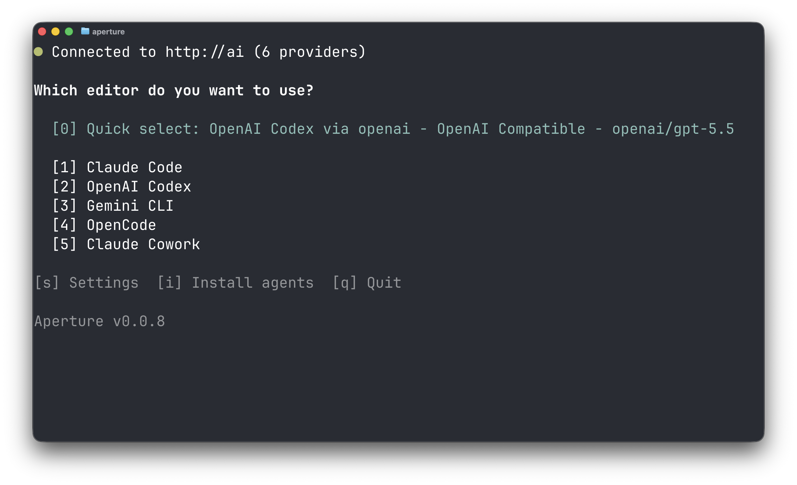

<h1 align="center">aperture-cli</h1>

<p align="center">
  <a href="#supported-agents">Supported agents</a> |
  <a href="#installation">Installation</a> |
  <a href="#usage">Usage</a> |
  <a href="#development">Development</a>
</p>

<p align="center">
  
</p>

> [!WARNING]
> **This repository is alpha software.** It is under active development and may change significantly without notice.

A CLI launcher for coding agents preconfigured to work with [Aperture](https://aperture.tailscale.com). It manages installation, configuration and environment variables that make using multiple providers and models very easy.

## Supported agents

- [Claude Code](https://docs.anthropic.com/en/docs/claude-code)
- [Gemini CLI](https://github.com/google-gemini/gemini-cli)
- [OpenCode](https://github.com/sst/opencode)
- [Codex](https://github.com/openai/codex)
- [GitHub Copilot CLI](https://docs.github.com/en/copilot/how-tos/copilot-cli/cli-getting-started)
- [Claude Cowork](https://support.claude.com/en/articles/13345190-get-started-with-claude-cowork)

## Installation

```sh
go install github.com/tailscale/aperture-cli/cmd/aperture@latest
```

Or build from source:

```sh
make build
```

## Usage

```sh
aperture
```

On first run, `aperture` will attempt to connect to `http://ai`. If it cannot reach that host, it will prompt you to configure an Aperture endpoint.

### Bridge mode

Bridge mode lets Aperture CLI reach an Aperture endpoint through an embedded Tailscale node. Only the Aperture CLI proxy appears on the tailnet; the rest of the machine does not need the full Tailscale client installed or connected to that tailnet.

This is useful on machines where installing Tailscale is not practical, where Aperture needs to work alongside another VPN, or where you need to switch tailnets while continuing to use a single Aperture instance.

To use bridge mode:

1. Open `Settings`, then open `Bridges` and press `a` to add a bridge.
2. Go back to `Settings`, then open `Aperture Endpoints` and press `a` to add an endpoint.
3. Choose `Bridge`, select the bridge you created, then enter the Aperture URL.
4. Select the bridged endpoint so it becomes active.
5. Follow the Tailscale login prompt for the bridge.
6. Launch an agent.

### Flags

| Flag | Description |
|------|-------------|
| `-version` | Print build version and exit |
| `-debug` | Print environment variables set before launching the agent |

## Development

```sh
make build   # build ./aperture
make test    # run tests
make install # install to $GOPATH/bin
make clean   # remove built binary
```
