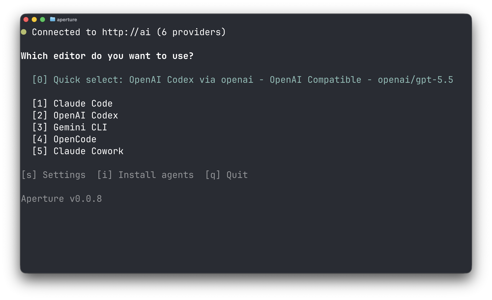

<h1 align="center">aperture-cli</h1>

<p align="center">
  <a href="#supported-agents">Supported agents</a> |
  <a href="#installation">Installation</a> |
  <a href="#usage">Usage</a> |
  <a href="#development">Development</a> |
  <a href="#contributing">Contributing</a>
</p>

<p align="center">
  
</p>

> [!WARNING]
> **This repository is alpha software.** It is under active development and may change significantly without notice.

A CLI launcher for coding agents preconfigured to work with [Aperture](https://aperture.tailscale.com). It manages installation, configuration and environment variables that make using multiple providers and models very easy.

## Supported agents

- [Claude Code](https://docs.anthropic.com/en/docs/claude-code)
- [Gemini CLI](https://github.com/google-gemini/gemini-cli)
- [OpenCode](https://github.com/sst/opencode)
- [Codex](https://github.com/openai/codex)
- [GitHub Copilot CLI](https://docs.github.com/en/copilot/how-tos/copilot-cli/cli-getting-started)
- [Hermes Agent](https://hermes-agent.nousresearch.com)
- [Oh My Pi](https://omp.sh)
- [Pi](https://pi.dev)
- [Claude Cowork](https://support.claude.com/en/articles/13345190-get-started-with-claude-cowork)

## Installation

```sh
curl -fsSL https://raw.githubusercontent.com/tailscale/aperture-cli/main/install.sh | sh
```

The script downloads the matching release asset, verifies it against the release checksums and installs `aperture` to `/usr/local/bin`. Set `APERTURE_INSTALL_DIR=$HOME/.local/bin` to skip sudo, `APERTURE_VERSION=v0.0.13` to pin a release.

With Go:

```sh
go install github.com/tailscale/aperture-cli/cmd/aperture@latest
```

Or build from source:

```sh
make build
```

macOS builds are Developer ID signed and notarized. curl and `go install` never set the quarantine attribute, so Gatekeeper stays out of the way. If you download the archive in a browser and double-click the binary instead, macOS may block it anyway (common on managed Macs): open System Settings > Privacy & Security and click **Open Anyway** next to the blocked entry.

## Usage

```sh
aperture
```

On first run, `aperture` will attempt to connect to `http://ai`. If it cannot reach that host, it will prompt you to configure an Aperture endpoint.

### Bridge mode

Bridge mode lets Aperture CLI reach an Aperture endpoint through an embedded Tailscale node. Only the Aperture CLI proxy appears on the tailnet; the rest of the machine does not need the full Tailscale client installed or connected to that tailnet.

This is useful on machines where installing Tailscale is not practical, where Aperture needs to work alongside another VPN, or where you need to switch tailnets while continuing to use a single Aperture instance.

To use bridge mode:

1. Press `c` on the agent menu for `Change connection` (the same screen as `Settings`, then `Aperture Endpoints`).
2. Choose `Add a connection`, then `Bridge`, then an existing bridge or `Add Bridge`.
3. Authorize the bridge. Aperture CLI opens your browser at the Tailscale login link; if it cannot, the link stays on screen to open by hand. No URL is asked for: the bridge looks for Aperture at `http://ai`, the same location a direct connection starts from.
4. Aperture CLI verifies `/v1/models`, makes the endpoint active, and returns to the agent menu.

If your Aperture answers on a different hostname, type it on the connect screen while the default is being tried. That cancels the attempt and connects to what you typed. Esc abandons the attempt and leaves your current endpoint alone.

### Choosing a connection

`Change connection` lists everything this launcher can reach: each saved endpoint, and each bridge that has no endpoint yet, labelled with the tailnet it reaches. That is the screen to use when the launcher connected on its own and you wanted the other bridge.

Selecting a row opens it. From there you can connect to it, change its URL, switch its tailnet, or remove it.

`http://ai` can answer and still be the wrong Aperture, which is what happens when the bridge joins a tailnet that already has a host called `ai`. `Change URL` points the connection somewhere else; it keeps the bridge it is reached through and reconnects.

### Switching tailnets

A bridge is on one tailnet at a time. `Switch tailnet` logs it out, which removes its node from that tailnet, then prints a new login link: open it and pick the tailnet you want. Use a second bridge instead if you want to keep both logins and choose between them.

If verification fails, the endpoint remains configured for retry or editing, and any previous working endpoint remains active.

### Concurrent sessions

Each aperture process on a bridge is its own device on the tailnet. The first process uses the bridge's original identity; each additional one registers a numbered sibling (`aperture-cli-<bridge>-2` and up). Sharing one identity would let the control plane hand the session to whichever process registered last, silently cutting off the others.

A fresh device needs one login. Set `TS_AUTHKEY` to a reusable auth key and new devices authorize without the browser; devices already registered keep their credentials on disk and never consult the key again. The key decides which tailnet a fresh device joins, so use a key from the tailnet your Aperture is on.

### Flags

| Flag | Environment | Description |
|------|-------------|-------------|
| `-version` | | Print build version and exit |
| `-debug` | | Print environment variables set before launching the agent |
| `-endpoint` | `APERTURE_ENDPOINT` | Aperture URL to open on, instead of the saved one |
| `-bridge` | `APERTURE_BRIDGE` | Connect through the bridge with this name, creating it if there is none |

A flag beats its environment variable, so a one-off run can override whatever
the shell was started with. `-bridge` on its own starts at the well-known
location, the same guess the connection picker makes:

```sh
aperture -bridge work                                   # http://ai over the "work" bridge
aperture -bridge work -endpoint aperture.example.com    # that URL over the "work" bridge
aperture -endpoint aperture.example.com                 # direct, no bridge
```

Neither is made the saved active endpoint until the connection works, so an
unreachable URL passed on the command line does not displace the one that does
work.

## Development

```sh
make build   # build ./aperture
make test    # run tests
make install # install to $GOPATH/bin
make clean   # remove built binary
```

## Releasing

Push a tag. The release workflow runs GoReleaser on a macOS runner: it imports the Developer ID certificate from GitHub secrets into a temporary keychain, and a build hook signs and notarizes each darwin binary before archiving, so nothing unsigned is ever published. A failed signature or a rejected notarization fails the run before upload. Required secrets: `APPLE_CERT_P12` (the base64-encoded .p12), `APPLE_CERT_PASSWORD`, `APPLE_ID` and `APPLE_ID_PASSWORD` (an app-specific password).

Local fallback on a Mac that has the certificate and a stored notary profile, for when the workflow could not sign:

```sh
make release-mac-notarized VERSION=v0.0.14   # build, sign, notarize, verify
make upload-mac VERSION=v0.0.14              # after the tag's workflow publishes
```

The fallback uploads signed zips and removes the unsigned tarballs, which is why the installer accepts either.

## Contributing

To add a new coding agent, see [docs/adding-a-client.md](./docs/adding-a-client.md).
