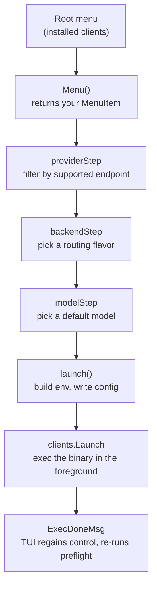

# Add support for a new client

This guide is for contributors who want to add a new coding agent to `aperture-cli`. The repository ships several command-line agents, each in its own self-contained package under `internal/clients`, plus Claude Cowork as a desktop app in `internal/profiles`. If you have used a harness like OpenCode or Pi and want `aperture` to launch it preconfigured against an Aperture endpoint, this walks you through the whole path. By the end you will have a new package that appears in the launcher menu, installs and uninstalls itself, routes the harness through an Aperture endpoint, replays the last session on the quick-select row, and passes CI.

One naming note before you start. This guide says "harness" because that is the word you probably arrived with, but the codebase does not use it. In the code, a harness is a **client**: the interface is `clients.Client`, the registry is `internal/clients`, and each harness is a sub-package such as `internal/clients/opencode`. When you read code or write comments, use "client" so your work matches everything around it.

## Requirements and assumptions

Before you start, make sure the following are true. The guide does not teach these things and will not work well without them.

- You have Go 1.26.6 or newer installed, which is the version pinned in `go.mod` and the lower bound of the CI matrix.
- You have cloned the `tailscale/aperture-cli` repository and can run `make build` and `make test` successfully on an unmodified checkout.
- You are comfortable reading and writing Go, including interfaces, methods on pointer receivers, closures, and table-driven tests.
- You have the harness you want to add already installed on your machine, so you can test a real launch.
- You have a reachable Aperture endpoint to test against, and you know its URL. The default is `http://ai`, which resolves over Tailscale.
- You know, or can find out, how your harness accepts a custom API base URL and a custom API key. This is the single most important prerequisite, and Step 1 covers how to find it.
- You are working on macOS or Linux. The guide's commands assume a POSIX shell. The code you write will be cross-platform, but the shell snippets are not.
- You have read the top-level comment in `internal/clients/registry.go`, which is the closest thing the repo has to a contract for this work.

The guide does not cover adding a graphical desktop application. Claude Cowork is a desktop app and it lives in `internal/profiles` behind an adapter, which is a different and more awkward path. Everything here assumes your harness is a command-line binary.

## Variables

You will substitute your own values into the code and commands throughout this guide. Decide each of these before you start writing code, and use the same value everywhere the placeholder appears.

| Variable | Description |
|---|---|
| `<INSERT_PACKAGE_NAME>` | The Go package name and directory name for your client, lowercase with no separators. Existing examples are `opencode`, `codex`, and `claudecode`. |
| `<INSERT_DISPLAY_NAME>` | The name the user sees in the launcher menu, written the way the vendor writes it. Existing examples are `OpenCode`, `Gemini CLI`, and `GitHub Copilot`. |
| `<INSERT_BINARY_NAME>` | The name of the executable as it appears on `$PATH`, for example `opencode` or `claude`. |
| `<INSERT_INSTALL_COMMAND>` | The shell command that installs the harness, for example `npm install -g @openai/codex`. Get this from the harness's own documentation. |
| `<INSERT_UNINSTALL_COMMAND>` | The shell command that uninstalls the harness, for example `npm uninstall -g @openai/codex`. Step 5 uses this twice: once verbatim as a display hint, and once split into separate arguments (`"npm", "uninstall", "-g", "@openai/codex"`) because there is no shell to split it. If the harness has no uninstall command, Step 5 explains what to do instead. |
| `<INSERT_ENDPOINT_CONST>` | The `config.Endpoint*` constant naming the API path your harness needs a provider to serve, for example `config.EndpointOpenAIResponses`. Step 2 lists the constants and explains how to pick yours. |
| `<INSERT_BACKEND_ID>` | A short stable identifier your client records in `LaunchState.LastBackendType` and matches again on replay, for example `openai_chat`. It is private to your client. If you built a `backend` struct in Step 7, this is its `id`. Step 9 covers it. |
| `<INSERT_APERTURE_URL>` | The URL of the Aperture endpoint you will test against, for example `http://ai` or `https://ai.example.com`. |
| `<INSERT_HARNESS_BASE_URL_VAR>` | The environment variable your harness reads for its API base URL, for example `OPENAI_BASE_URL`. Step 1 explains how to find it. |
| `<INSERT_HARNESS_API_KEY_VAR>` | The environment variable your harness reads for its API key, for example `OPENAI_API_KEY`. Found the same way. |
| `<INSERT_HARNESS_MODEL_VAR>` | The environment variable your harness reads for its default model, for example `OPENAI_MODEL`. If your harness has no such variable, delete the whole `if model != ""` block that sets it in Step 9 rather than leaving the placeholder in place. |
| `<INSERT_HARNESS_YOLO_FLAG>` | The command-line flag that makes your harness skip permission prompts, for example `--yolo`. If your harness has no such flag, delete the whole `args` block in Step 9 rather than leaving the placeholder in place. |
| `<INSERT_HARNESS_CONFIG_VAR>` | The environment variable that points your harness at a config file or config directory, for example `OPENCODE_CONFIG`. Only needed if Step 1 told you your harness requires a config file. |

## How it works

The launcher is a registry of clients plus a generic menu engine, and the two know almost nothing about each other. Each client sub-package declares itself at startup by calling `clients.Register` from an `init()` function, as in `internal/clients/opencode/opencode.go:20`. That `init()` only runs if the package is linked into the binary, which is why `cmd/aperture/main.go:21` holds a block of underscore imports whose only purpose is that side effect. Forgetting to add your package to that block is the most common way for a new client to silently not exist.

That `init()` call is also why this guide leaves it until the very end. `clients.Register` takes a `clients.Client`, so the moment you write it, your package stops compiling until every one of the interface's nine methods exists. Adding it last keeps the package buildable and testable at each step along the way.

Everything the launcher can do with a client goes through the `clients.Client` interface in `internal/clients/registry.go:16`. The interface is deliberately wide, because each client owns its own flow end to end. The TUI never asks "what providers does this client support" or "what environment variables does it need". It asks for a `menu.MenuItem` and renders it, and the client's own closures take over from there. The TUI reads the registry through one indirection, the `registeredClients` variable in `internal/tui/tui.go`, which exists so tests can swap in fakes.

The user's path through a client looks like this. Nothing in the diagram is mandatory except the first and last box, and Step 7 explains how to collapse the middle steps when there is only one option.



Two things decide most of the work. The first is how your harness accepts a custom base URL. Some harnesses read environment variables only, which makes the client short: GitHub Copilot is entirely `buildEnv` at `internal/clients/copilot/copilot.go:173`. Others need a config file on disk, so the client writes one per launch and points the harness at it with a single environment variable, which is what `writeProviderConfig` does at `internal/clients/opencode/sdk.go:79`. The second is which API protocols your harness speaks, because the launcher only offers a client the providers that can serve it.

That second part works through the supported-endpoint set. On startup the TUI fetches `GET /v1/models` from the active Aperture endpoint and hands the body to `config.ParseProviders` (see `fetchProvidersContext` in `internal/tui/tui.go` and `internal/config/providers.go:69`). The response is an OpenAI-style `{"object":"list","data":[...]}` list of *model* rows, each carrying a `supported_endpoints` array of API paths and a `metadata.provider` object. `ParseProviders` aggregates those rows upward into one `config.ProviderInfo` per provider, unioning every model's endpoints into `SupportedEndpoints map[string]bool` and collecting the model IDs into `Models`. Your client filters that list down to providers it can actually talk to by calling `p.SupportsEndpoint(...)`, and if the list comes back empty it shows an error instead of a menu.

The TUI sends `User-Agent: aperture-cli` on that request on purpose. Aperture filters the model list for Claude Code user agents, and discovery needs the full grant-filtered list for every harness, not the Claude Code subset.

## Step 1: Work out how your harness accepts a custom base URL

Everything downstream depends on this answer, so get it before you write any Go. You are looking for two things: how to point the harness at an arbitrary HTTP endpoint instead of the vendor's own API, and how to satisfy its API key check without a real key.

Start with the harness's own documentation, searching for "base URL", "custom endpoint", "proxy", "self-hosted", or "OpenAI-compatible". Then check the harness's help output and its environment, which often reveals more than the docs do.

```bash
<INSERT_BINARY_NAME> --help
env | grep -i <INSERT_BINARY_NAME>
```

If the harness is open source, searching its source for `baseURL`, `base_url`, or `BASE_URL` is usually faster than reading its documentation.

Sort what you find into one of four shapes. In the environment-variable shape, the harness reads a base URL and an API key from the process environment and needs nothing on disk. GitHub Copilot works this way through `COPILOT_PROVIDER_BASE_URL` and friends. In the config-file shape, the harness insists on reading a config file, so your client writes that file at launch time and passes its path or its parent directory in one environment variable. OpenCode works this way through `OPENCODE_CONFIG` and Gemini CLI through `GEMINI_CLI_HOME`.

The third shape is a command-line override. The harness accepts its whole routing configuration as flags, so your client assembles them per launch and never writes to the harness's own home directory. Codex works this way: `apertureLaunchConfig` at `internal/clients/codex/config.go:16` emits `--config model_provider=...` and `--config model_providers.<name>=...` pairs, plus a `--config model_catalog_json=...` pointing at a temporary catalog built by `prepareModelCatalog` in `internal/clients/codex/catalog.go`. It deliberately leaves `CODEX_HOME` alone so the user's real Codex configuration and credentials keep working. Prefer this shape when you can get it.

The fourth shape is a plugin: the harness has no base-URL variable at all and no config file you can point at in isolation, but it can load a file of code that registers a provider at startup. Pi works this way. It accepts `-e <path>` and calls the file's exported function with its own extension API, which `internal/clients/pilike` uses to register one Aperture provider per launch. Treat this like the config-file shape, writing the file per launch and cleaning it up after, but note that it is code rather than data, so generate it by marshaling values to JSON and interpolating them rather than by hand-writing strings. Clean up on the next launch as well as on exit: a crash never runs your cleanup function, and `sweepOrphanedExtensions` in `internal/clients/pilike/extension.go` shows the pattern.

Do not assume a variable exists just because every other harness has one. Search the harness's own documentation and source for the exact name before writing it down. If you cannot find one, that is a finding, not a gap in your search — invent nothing. A harness with a permissive plugin API often has no URL variable at all, and a variable that looks right may not be an input: Pi *sets* `PI_MODEL` and `PI_PROVIDER` for the tools it spawns to read, so setting them yourself does nothing.

You will also need a value to satisfy the harness's API key check. Aperture handles authentication itself, so no real key is involved. The convention in this repo is a placeholder string, and existing clients use `not-needed`, `not-required`, or a bare `-` depending on what the harness accepts. Check whether the key is genuinely optional: Pi loads a provider without one, then silently hides its models from every picker, which looks like a compatibility bug rather than a missing placeholder.

Two more questions are worth settling now, because both are cheap to answer and expensive to discover later. First, if the harness needs an on-disk home directory, find out what else lives there — if the same directory also holds the user's saved logins, settings, or session history, redirecting it to an Aperture-owned path will hide all of that, and a per-launch plugin or config file is the better route. Second, if the harness has a "skip permission prompts" flag, confirm it actually governs tool approval. Pi's `--approve` looks like one but controls whether project-local config files are trusted, and wiring `YoloMode` to it would grant something the user did not ask for while still prompting for everything they did.

Write down the exact variable names and the exact config file schema before you continue. To verify you have enough, launch the harness by hand with those values set and confirm it reaches your Aperture endpoint. This one-off check saves you from debugging your Go code when the problem was the harness contract all along.

Then confirm your endpoint is reachable and answering, because nothing later in this guide works without it.

```bash
curl -s -H 'User-Agent: aperture-cli' <INSERT_APERTURE_URL>/v1/models
```

You should get back an OpenAI-style listing: an object with `"object": "list"` and a `data` array of *model* rows. Each row carries an `id`, a `supported_endpoints` array of API paths, and a `metadata.provider` object with `id`, `name`, `description`, `requires_client_auth`, and `upstream`. Keep that output open, because the next step reads it. If the request fails or returns nothing, fix your Aperture connectivity before continuing.

Note that the rows are models, not providers. There is no provider-level object in the response at all; `config.ParseProviders` synthesizes one per distinct `metadata.provider.id`. Sending `User-Agent: aperture-cli` matters for the same reason the TUI sends it: Aperture serves a filtered model list to Claude Code user agents.

## Step 2: Choose the endpoints your harness can speak

A supported endpoint is how your client declares which providers it can use. Pick the wrong one and your client will either never appear in a provider list or will appear and then fail at runtime.

The endpoints are canonical API paths, and they are centrally defined in this repository as constants at the top of `internal/config/providers.go:10`. That block is the authoritative list — use the constants rather than writing path strings by hand, so a rename reaches every client through the compiler.

```go
const (
	EndpointAnthropicMessages = "/v1/messages"
	EndpointOpenAIResponses   = "/v1/responses"
	EndpointOpenAIChat        = "/v1/chat/completions"
	EndpointGemini            = "/v1beta/models/{model}:generateContent"
	EndpointVertexGemini      = "/v1/projects/{project}/locations/{region}/publishers/google/models/{model}:generateContent"
	EndpointVertexClaude      = "/v1/projects/{project}/locations/{region}/publishers/anthropic/models/{model}:rawPredict"
	EndpointBedrockInvoke     = "/bedrock/model/{model}/invoke"
	EndpointBedrockConverse   = "/bedrock/model/{model}/converse"
)
```

Every client draws from that one block. The longest selection is `supportedEndpoints` in `internal/clients/opencode/opencode.go:34`, which names all eight. Aperture may advertise paths the constants do not cover — `SupportedEndpoints` is an open map keyed on whatever the server sent, so an unknown path lands in it harmlessly and simply matches nothing.

Map the protocol you found in Step 1 onto one or more of these constants. A harness that speaks OpenAI Chat Completions wants `config.EndpointOpenAIChat`. One that speaks the newer OpenAI Responses API wants `config.EndpointOpenAIResponses`. One that speaks Anthropic's Messages API wants `config.EndpointAnthropicMessages`.

How many endpoints you need decides how much menu you write. If your harness speaks exactly one protocol, you need one constant and no backend step, which is what Codex does by testing `config.EndpointOpenAIResponses` directly in `compatibleProviders` at `internal/clients/codex/codex.go:222`. If it speaks several and the user should choose between them, you need a `backend` struct with an `endpoint` field and one entry per protocol, which is what Copilot does at `internal/clients/copilot/copilot.go:37`. If it speaks several but the choice can be made for the user automatically, you need a list of endpoints and a resolver, which is what OpenCode does in `pickSDK` at `internal/clients/opencode/sdk.go:35`.

To verify your choice, inspect the JSON from Step 1 and confirm at least one model on your endpoint lists your path in its `supported_endpoints`. This aggregates the rows the way `ParseProviders` does.

```bash
curl -s -H 'User-Agent: aperture-cli' <INSERT_APERTURE_URL>/v1/models | python3 -c '
import json, sys
provs = {}
for m in json.load(sys.stdin)["data"]:
    p = m["metadata"]["provider"]
    e = provs.setdefault(p["id"], {"upstream": p["upstream"], "models": 0, "eps": set()})
    e["models"] += 1
    e["eps"].update(m.get("supported_endpoints") or [])
for pid, v in provs.items():
    up, n, eps = v["upstream"], v["models"], sorted(v["eps"])
    print(f"{pid:22} upstream={up:16} models={n:3} {eps}")
'
```

On a typical endpoint that prints something like this, and the paths on the right are exactly what `SupportsEndpoint` is matching against.

```
vercel-ent-zdr         upstream=vercel           models= 38 ['/v1/chat/completions', '/v1/messages', '/v1/responses']
anthropic              upstream=anthropic        models= 14 ['/v1/chat/completions', '/v1/messages']
openai-api             upstream=openai           models= 28 ['/v1/chat/completions', '/v1/responses']
bedrock                upstream=bedrock-runtime  models= 12 ['/bedrock/model/{model}/converse', ...]
```

If no provider serves your path, your client will correctly refuse to launch, and that is a configuration problem on the Aperture side rather than something to work around in code.

One provider distinction cannot be made from endpoints alone. A Mantle provider speaks the Anthropic Messages protocol like any other, but Claude Code needs a different transport mode for it, so `backendMatches` at `internal/clients/claudecode/claudecode.go:299` keys off `p.Upstream == "bedrock-mantle"` before it looks at endpoints at all. If your harness needs a similar distinction, `ProviderInfo.Upstream` is where it lives. `ProviderInfo.RequiresClientAuth` is available on the same struct for providers that want the caller's own credentials.

## Step 3: Create the package directory and files

Now create the package. Every client sub-package follows the same file layout, and matching it makes your code reviewable by anyone who has read the others.

Run this from the repository root. It creates the directory and the three files you will fill in, each with its package clause already in place.

```bash
mkdir -p internal/clients/<INSERT_PACKAGE_NAME>
cd internal/clients/<INSERT_PACKAGE_NAME>
printf 'package <INSERT_PACKAGE_NAME>\n' > <INSERT_PACKAGE_NAME>.go
printf 'package <INSERT_PACKAGE_NAME>\n' > install.go
printf 'package <INSERT_PACKAGE_NAME>\n' > <INSERT_PACKAGE_NAME>_test.go
cd -
```

Write the package clause now rather than creating the files empty. A zero-byte `.go` file is a parse error, not an empty package, so `go build ./...` fails with `expected 'package', found 'EOF'` for every empty file in the directory — which would break the verification at the end of this step and every step after it until all three files have content.

The main file holds the `Client` type and every interface method. The `install.go` file holds only `commonBinaryPaths`, kept separate because it is the one function that tends to differ per operating system. The test file holds your table-driven tests. If your harness needs routing configuration built outside the main file, Step 8 adds a fourth file for it: `sdk.go` in OpenCode, `config.go` in Gemini and Codex, and `extension.go` in `internal/clients/pilike`, the package shared by Pi and Oh My Pi.

A harness that speaks the same plugin API as one already in the repo is the exception to this layout. Share the existing package instead of forking it, so a change lands once and the reasoning behind it stays in one place. `internal/clients/pilike` is the example: it holds the whole client, and `internal/clients/pi` and `internal/clients/omp` hold only a `pilike.Variant` describing what differs, such as the display name, the binary name, the install command, and the yolo arguments. Add a field to `Variant` for each real difference you find, and resist copying the package to change a string.

Open the main file and replace its bare package clause with the doc comment, the package declaration, the type, and your constants. The doc comment matters more here than in most Go code, because the existing client packages each explain their routing model up front and reviewers will look for that.

```go
// Package <INSERT_PACKAGE_NAME> is the <INSERT_DISPLAY_NAME> client. Describe
// here which protocols it speaks, how routing is configured (environment
// variables, a config file, CLI overrides, or a mix), and what the menu flow
// looks like.
package <INSERT_PACKAGE_NAME>

// Client is the <INSERT_DISPLAY_NAME> client.
type Client struct{}

const (
	name       = "<INSERT_DISPLAY_NAME>"
	binaryName = "<INSERT_BINARY_NAME>"
)
```

The endpoint your client needs is not a constant of your own: it is `<INSERT_ENDPOINT_CONST>` from `internal/config`, referenced directly wherever you need it. No client declares a private copy of an endpoint path.

`Client` is an empty struct because clients hold no state of their own. All state lives in the `*config.Global` that gets passed into each method.

There are deliberately no imports and no `init()` yet. Go treats an unused import as a compile error, so adding the import block before the code that uses it would break the build, and Step 11 adds the `init()` once every interface method exists. Add each import as the step that needs it arrives, or let your editor do it.

To verify, build the whole module.

```bash
go build ./...
```

That should produce no output at all. Your package now compiles, which means you can keep it compiling after every step that follows. If you see an error about an unused import, delete the import rather than the code. If you see `expected 'package', found 'EOF'`, one of your three files is still empty; give it the package clause shown above.

## Step 4: Implement identity and binary discovery

These four methods tell the launcher what your client is called and whether it is installed. They are the shortest methods in the interface and none of them make decisions.

Add them to your main file, below the constants, along with the `clients` import they need.

```go
import "github.com/tailscale/aperture-cli/internal/clients"
```

```go
// Name implements clients.Client.
func (c *Client) Name() string { return name }

// BinaryName implements clients.Client.
func (c *Client) BinaryName() string { return binaryName }

// CommonPaths implements clients.Client.
func (c *Client) CommonPaths() []string { return commonBinaryPaths() }

// IsInstalled implements clients.Client.
func (c *Client) IsInstalled() bool {
	return clients.IsInstalled(binaryName, c.CommonPaths())
}
```

`Name` is what the user reads in the menu. `BinaryName` is what gets looked up on `$PATH`. `CommonPaths` covers the case where the binary exists but `$PATH` does not know about it yet, which happens constantly right after an install has updated a shell profile that the running shell has not reloaded. Delegate `IsInstalled` to the shared helper rather than writing your own check, so binary discovery stays consistent across clients.

Now fill in `install.go` with the paths where your harness's installer actually puts the binary.

```go
package <INSERT_PACKAGE_NAME>

import (
	"os"
	"path/filepath"
)

// commonBinaryPaths returns the non-PATH locations where
// <INSERT_BINARY_NAME> is commonly installed.
func commonBinaryPaths() []string {
	home, err := os.UserHomeDir()
	if err != nil {
		return nil
	}
	return []string{
		filepath.Join(home, ".local", "bin", "<INSERT_BINARY_NAME>"),
	}
}
```

Return full paths to the binary, not directories. `FindBinary` at `internal/clients/binary.go:19` treats these entries as complete paths and stats each one directly. You do not need to list `~/.local/bin`, `~/bin`, or `~/.npm-global/bin`, because `commonBinDirs` in the same file already checks those for every client. Add an entry only for a location specific to your harness, the way OpenCode adds `~/.opencode/bin/opencode`.

To verify, confirm the package still builds and that your harness is where you think it is.

```bash
go build ./... && which <INSERT_BINARY_NAME>
```

The build should print nothing, and `which` should print a path. If `which` prints a path, `IsInstalled` will return `true` through the `$PATH` lookup alone. To confirm your `commonBinaryPaths` entries also work, temporarily remove the binary's directory from `$PATH` in a throwaway shell and check that `which` fails while the path you listed still exists on disk.

## Step 5: Describe how to install and uninstall the harness

The launcher can install a harness for the user from the `[i] Install agents` menu, and remove it from `Settings` then `Uninstall`. Both are described declaratively: your client returns a plan, and the TUI shows the hint, asks for confirmation, and runs the command.

Add both methods to your main file, and add `"os/exec"` and `"github.com/tailscale/aperture-cli/internal/config"` to its imports.

```go
// Install implements clients.Client.
func (c *Client) Install(_ *config.Global) clients.InstallPlan {
	return clients.InstallPlan{
		Hint: "<INSERT_INSTALL_COMMAND>",
		Run: func() (*exec.Cmd, error) {
			return exec.Command("bash", "-o", "pipefail", "-c", "<INSERT_INSTALL_COMMAND>"), nil
		},
	}
}

// Uninstall implements clients.Client.
func (c *Client) Uninstall() clients.UninstallPlan {
	return clients.UninstallPlan{
		Hint: "<INSERT_UNINSTALL_COMMAND>",
		Run: func() error {
			// Split into separate arguments: there is no shell here.
			return exec.Command("npm", "uninstall", "-g", "@openai/codex").Run()
		},
	}
}
```

Note the difference between the two `Run` fields. `Install.Run` passes the command as one string to a shell, which splits it. `Uninstall.Run` has no shell, so you must split `<INSERT_UNINSTALL_COMMAND>` into its arguments yourself, exactly as Codex does in `npmUninstallPlan` at `internal/clients/codex/codex.go:88`. The example above is Codex's literal argument list — substitute your own. Passing the whole command as a single argument compiles fine and then fails at runtime with `fork/exec npm uninstall -g ...: no such file or directory`, because it looks for one executable whose filename contains spaces. No build or test step catches this, so get it right here.

Use `bash -o pipefail -c` rather than `/bin/sh -c` whenever your install command contains a pipe. A plain shell reports only the exit status of the last stage, so `curl -fsSL ... | bash` succeeds with status zero when the download 404s and the empty body is piped into a shell that has nothing to do. With `pipefail` the failing `curl` propagates. Claude Code and OpenCode both do this, at `internal/clients/claudecode/claudecode.go:76` and `internal/clients/opencode/opencode.go:64`. Clients whose install command has no pipe, such as Copilot's bare `npm install -g`, still use `/bin/sh -c`.

The `Hint` is shown to the user verbatim before they confirm, so write the actual command rather than a description of it. `Install.Run` returns an `*exec.Cmd` that the TUI executes, and it returns rather than runs the command so the TUI controls the terminal handoff.

A zero exit status is not on its own treated as success. After the installer finishes, `installDoneMsg` at `internal/tui/menus.go:648` calls `client.IsInstalled()` and reports a failure if the binary still cannot be found, which catches an installer that printed an error and exited clean. Leave `SkipInstalledCheck` at its zero value so you get that check. Set it to `true` only when your `Run` merely *starts* a user-driven installation and cannot itself finish one — opening a vendor download page, for example, which is why the Claude Cowork desktop adapter sets it at `internal/profiles/adapter.go:46`.

Two cases need different handling. If your harness has no scripted install, set `Run` to `nil` and the TUI will show the hint and do nothing, leaving the user to install it by hand. If uninstalling means deleting files rather than running a command, do the deletion in Go, the way Claude Code does at `internal/clients/claudecode/claudecode.go:82`.

Verify with a test rather than by actually installing anything, following the pattern in `TestInstallPlan` at `internal/clients/codex/codex_test.go:67`. Put this in your test file, which needs the package clause and two imports.

```go
package <INSERT_PACKAGE_NAME>

import (
	"testing"

	"github.com/tailscale/aperture-cli/internal/config"
)

func TestInstallUninstall(t *testing.T) {
	c := &Client{}
	install := c.Install(&config.Global{})
	if install.Hint != "<INSERT_INSTALL_COMMAND>" {
		t.Errorf("Install.Hint = %q", install.Hint)
	}
	if install.Run == nil {
		t.Error("Install.Run is nil")
	}

	uninstall := c.Uninstall()
	if uninstall.Hint != "<INSERT_UNINSTALL_COMMAND>" {
		t.Errorf("Uninstall.Hint = %q", uninstall.Hint)
	}
	if uninstall.Run == nil {
		t.Error("Uninstall.Run is nil")
	}
}
```

Replace the bare package clause in your test file with the block above. The test lives in your own package rather than a `_test` package, so it can reach unexported identifiers such as `name` and `binaryName`. Note that it asserts only on the hints and on `Run` being non-nil — it never invokes `Run`, because doing so would really uninstall your harness. That is why the argument-splitting mistake described above survives a green test suite.

If your install command is piped, assert on the argument list too, so nobody quietly reverts the `pipefail` wrapper. This is `TestInstallCommandDetectsPipelineFailures` from `internal/clients/opencode/opencode_test.go:15`; it needs `slices` added to your test imports.

```go
func TestInstallCommandDetectsPipelineFailures(t *testing.T) {
	plan := (&Client{}).Install(&config.Global{})
	cmd, err := plan.Run()
	if err != nil {
		t.Fatal(err)
	}
	if !slices.Equal(cmd.Args, []string{
		"bash", "-o", "pipefail", "-c", "<INSERT_INSTALL_COMMAND>",
	}) {
		t.Errorf("install command args = %q, want bash with pipefail", cmd.Args)
	}
}
```

Run it to confirm.

```bash
go test ./internal/clients/<INSERT_PACKAGE_NAME>/
```

You should see `ok` and the package path. Tests run at this point precisely because you have not added `init()` yet.

## Step 6: Filter providers by supported endpoint

Your client must decide which of the endpoint's providers it can use. This is a small piece of code with an outsized effect, because it gates whether the client shows a menu at all, and Step 10 reuses it to decide whether a replay is still valid.

Add these helpers near the bottom of your main file, next to the other unexported functions.

```go
// compatibleProviders returns the subset of providers this client can use.
func compatibleProviders(all []config.ProviderInfo) []config.ProviderInfo {
	var out []config.ProviderInfo
	for _, p := range all {
		if providerMatches(p) {
			out = append(out, p)
		}
	}
	return out
}

func providerMatches(p config.ProviderInfo) bool {
	return p.SupportsEndpoint(<INSERT_ENDPOINT_CONST>)
}
```

That is the single-protocol version. `SupportsEndpoint` reads `SupportedEndpoints`, which is a `map[string]bool`, so a provider that does not advertise the path yields `false` without any existence check.

If your harness speaks several protocols, `providerMatches` should return true when any of them match, as OpenCode does at `internal/clients/opencode/opencode.go:186`. If the user chooses between protocols, replace `providerMatches` with a `backendsFor` function that returns every matching backend and treat a non-empty result as a match, as Copilot does at `internal/clients/copilot/copilot.go:248`.

Most clients also need the model list in fully-qualified form, because the launcher displays models as `provider_id/model_id` while harnesses usually want the bare model ID. If your client offers a model choice, add both helpers, and add `"strings"` to your imports for the second one.

```go
// fqnModels returns the provider's models in "provider_id/model_id" form.
func fqnModels(p config.ProviderInfo) []string {
	out := make([]string, len(p.Models))
	for i, m := range p.Models {
		out[i] = p.ID + "/" + m
	}
	return out
}

func stripProviderPrefix(fqn string) string {
	if _, after, ok := strings.Cut(fqn, "/"); ok {
		return after
	}
	return fqn
}
```

Using `stripProviderPrefix` before you put a model name into the environment is not optional. Leaving the prefix on breaks path-based routing, and there is a comment explaining a concrete instance of that breakage at `internal/clients/claudecode/claudecode.go:328`.

Verify with a test in the style of `TestCompatibleProviders` at `internal/clients/opencode/opencode_test.go:29`. Add it to the test file you started in Step 5.

```go
func TestCompatibleProviders(t *testing.T) {
	provs := []config.ProviderInfo{
		{ID: "match", SupportedEndpoints: map[string]bool{<INSERT_ENDPOINT_CONST>: true}},
		{ID: "nomatch", SupportedEndpoints: map[string]bool{"/unknown": true}},
	}
	got := compatibleProviders(provs)
	if len(got) != 1 || got[0].ID != "match" {
		t.Errorf("compatibleProviders = %+v, want just the matching provider", got)
	}
}
```

Constructing a `ProviderInfo` literal by hand is the normal way to test a filter, but note what it skips: `ParseProviders` never produces a provider with a nil `SupportedEndpoints` map, because it allocates one for every provider it creates. It also never produces one with a model ID appearing twice, since it de-duplicates as it aggregates. A provider with zero models is possible only if the endpoint sends no rows for it, which cannot happen given that providers are discovered *from* model rows.

Run the tests and confirm both pass.

```bash
go test ./internal/clients/<INSERT_PACKAGE_NAME>/
```

The filter is now the only thing standing between the provider list and your menu.

## Step 7: Build the menu flow

This step turns your client into something the user can actually select. `Menu` is the entry point the root menu renders, and each subsequent step either descends automatically or shows a submenu.

Add `Menu` and the provider step to your main file. Both need the `menu` package, and the error helper at the end of this step needs Bubble Tea, so add these two imports now.

```go
	tea "github.com/charmbracelet/bubbletea"
	"github.com/tailscale/aperture-cli/internal/menu"
```

```go
// Menu implements clients.Client.
func (c *Client) Menu(g *config.Global) menu.MenuItem {
	return menu.MenuItem{
		Label:  name,
		Action: func() menu.Result { return c.providerStep(g) },
	}
}

func (c *Client) providerStep(g *config.Global) menu.Result {
	provs := compatibleProviders(g.Providers)
	if len(provs) == 0 {
		return errorResult("No providers support <INSERT_DISPLAY_NAME>.")
	}
	if len(provs) == 1 {
		return c.modelStep(g, provs[0])
	}
	items := make([]menu.MenuItem, 0, len(provs))
	for _, p := range provs {
		items = append(items, menu.MenuItem{
			Label:       p.DisplayName(),
			Description: p.Description,
			Action:      func() menu.Result { return c.modelStep(g, p) },
		})
	}
	return menu.Result{Next: &menu.Menu{
		Title: "Choose a provider for " + name + ":",
		Items: items,
	}}
}
```

Three conventions are at work there, and every existing client follows all three. An empty list produces an error rather than an empty menu. A single option descends straight to the next step instead of making the user press Enter on a menu of one. Anything more shows a submenu returned as `Result.Next`, which pushes onto the TUI's menu stack so Esc pops back.

The loop variable capture is safe here because each iteration gets a fresh `p`. That has been true since Go 1.22, and this repository targets Go 1.26.6, so you do not need the old workaround. You may still see `c := c` or `p := p` lines in code such as `internal/tui/menus.go:195`; they are no longer necessary and you do not need to copy them.

Add the model step next. This one shows the model picker only when there is a real choice to make.

```go
func (c *Client) modelStep(g *config.Global, p config.ProviderInfo) menu.Result {
	models := fqnModels(p)
	if len(models) <= 1 {
		var m string
		if len(models) == 1 {
			m = models[0]
		}
		return c.launch(g, p, m)
	}
	items := make([]menu.MenuItem, 0, len(models))
	for _, m := range models {
		items = append(items, menu.MenuItem{
			Label:  m,
			Action: func() menu.Result { return c.launch(g, p, m) },
		})
	}
	return menu.Result{Next: &menu.Menu{
		Title: "Choose a default model for " + name + " via " + p.DisplayName() + ":",
		Items: items,
	}}
}
```

Note that zero models is not an error. It passes an empty model string through to `launch`, which then omits the model environment variable entirely and lets the harness pick its own default. In practice a provider always has at least one model, because `ParseProviders` discovers providers *from* model rows, so the zero branch is defensive rather than load-bearing. If your harness has its own model picker, skip the model step entirely and go from provider straight to launch, as OpenCode does at `internal/clients/opencode/opencode.go:94`.

If Step 2 told you the user needs to choose a protocol, insert a backend step between the provider step and the model step. Define a `backend` struct with an `endpoint` field holding the relevant `config.Endpoint*` constant, plus whatever else your routing needs, and a package-level slice of them. Then write a `backendStep` with the same empty-check, single-option, submenu shape. `internal/clients/copilot/copilot.go:107` is the clearest example, and `internal/clients/gemini/gemini.go:119` shows a two-backend version.

Every client also needs a way to surface an error, so add this helper at the bottom of the file.

```go
func errorResult(msg string) menu.Result {
	return menu.Result{Cmd: func() tea.Msg {
		return menu.SimpleDoneMsg{Err: errString(msg)}
	}}
}

type errString string

func (e errString) Error() string { return string(e) }
```

A `SimpleDoneMsg` carrying an error puts the TUI into its error state and prints your message, which you can see handled at `internal/tui/tui.go:400`. The tiny `errString` type exists so you can build an error from a string without importing `errors` or `fmt`, and every client package declares its own copy.

The build will fail at this point, because your menu closures call a `launch` method that does not exist yet.

```bash
go build ./...
```

Expect two errors, one per closure that calls `launch`, both reading `c.launch undefined (type *Client has no field or method launch)`:

```
internal/clients/<INSERT_PACKAGE_NAME>/<INSERT_PACKAGE_NAME>.go:76:12: c.launch undefined (type *Client has no field or method launch)
internal/clients/<INSERT_PACKAGE_NAME>/<INSERT_PACKAGE_NAME>.go:82:42: c.launch undefined (type *Client has no field or method launch)
```

Your line numbers will differ. Step 9 resolves both. If you see errors naming anything other than `c.launch`, fix those before moving on.

This is the last verification until Step 9 if your harness needs no config file, or until the end of Step 8 if it does. Both of those steps end by building, so you will find out then whether anything you wrote here was wrong.

## Step 8: Write the routing config, if your harness needs one

Skip this step if Step 1 told you your harness is configured entirely through environment variables. Copilot has no config file at all, and its client is simpler for it.

Skip it too if Step 1 told you the harness takes its whole configuration as CLI flags. Codex is configured that way now and writes nothing durable; only its temporary model catalog touches disk.

If your harness does need a file, you have a choice about lifetime. A per-launch temporary file is right when the file's contents depend on the provider and model the user just picked, and it should be deleted when the harness exits. OpenCode works this way, as does Codex's model catalog. A persistent directory is right when the harness stores its own state alongside your config, such as credentials you do not want to destroy on every run. Gemini CLI works this way.

For the per-launch shape, create a new file `config.go` in your package and write a function that returns the path plus a cleanup closure. This is a condensed version of `writeProviderConfig` at `internal/clients/opencode/sdk.go:79`.

The whole file follows, including its imports and the `harnessConfig` struct. You must define that struct yourself: its fields and JSON tags have to match the schema your harness expects, which you wrote down in Step 1. The version below is a plausible shape, not a real harness's schema, so treat it as a template to replace rather than code to keep.

```go
package <INSERT_PACKAGE_NAME>

import (
	"encoding/json"
	"os"
	"path/filepath"

	"github.com/tailscale/aperture-cli/internal/config"
)

// harnessConfig is the on-disk schema <INSERT_DISPLAY_NAME> expects. Replace
// these fields and JSON tags with your harness's real schema.
type harnessConfig struct {
	BaseURL  string   `json:"baseUrl"`
	APIKey   string   `json:"apiKey"`
	Provider string   `json:"provider"`
	Models   []string `json:"models"`
}

// writeProviderConfig writes the per-launch config and returns its path plus
// a cleanup function that removes the file.
func writeProviderConfig(apertureHost string, p config.ProviderInfo) (string, func(), error) {
	cfg := harnessConfig{
		BaseURL:  apertureHost + "/v1",
		APIKey:   "not-needed",
		Provider: p.ID,
		Models:   p.Models,
	}
	data, err := json.Marshal(cfg)
	if err != nil {
		return "", nil, err
	}
	dir, err := config.ClientConfigDir("<INSERT_PACKAGE_NAME>")
	if err != nil {
		return "", nil, err
	}
	path := filepath.Join(dir, "tmp_aperture_config.json")
	if err := os.WriteFile(path, data, 0o600); err != nil {
		return "", nil, err
	}
	return path, func() { os.Remove(path) }, nil
}
```

The cleanup closure is the important part. You hand it to `clients.Launch` as `LaunchSpec.Cleanup`, and the TUI calls it after the harness process exits, as you can see at `internal/clients/launch.go:61`. Without it you leave a file containing your endpoint URL behind after every session.

Use `config.ClientConfigDir` from `internal/config/client_config.go:13` rather than building a path by hand. It returns `<UserConfigDir>/aperture/clients/<name>`, creates the directory with mode `0o700`, and keeps every client's files in one predictable place. Write files themselves with mode `0o600`. If your harness insists on a fixed location in the user's home directory, follow OpenCode's example and write there instead, but keep the permissions.

For the persistent shape, drop the cleanup function and return just the directory path, as `writeConfig` does at `internal/clients/gemini/config.go:17`. Note the comment in `gemini/config.go` explaining that its path is deliberately the pre-refactor legacy one, kept so existing user OAuth credentials keep resolving. If you ever need to move a path like that, expect to migrate the contents.

Before you commit to writing into the harness's own home directory, reconsider. Codex used to be configured by redirecting `CODEX_HOME`, which also relocated the user's real Codex state. It now passes `--config` overrides instead and leaves that directory untouched, and the doc comment on `config.ClientConfigDir` was narrowed to Gemini for exactly that reason. Redirect a harness's home only when it gives you no other way in.

First confirm the new file compiles. Your package as a whole still will not build, because Step 7's menu closures are still waiting on `launch`, so build just this package and expect the same two `c.launch undefined` errors and nothing else.

```bash
go build ./internal/clients/<INSERT_PACKAGE_NAME>/
```

If you see `undefined: json`, `undefined: os`, `undefined: filepath`, `undefined: config`, or `undefined: harnessConfig`, you are missing part of the file above — the import block or the struct definition.

Then verify the behavior with a test. Add this to your test file, which now needs four more imports: `encoding/json`, `os`, `path/filepath`, and `testing`.

```go
func TestWriteProviderConfig(t *testing.T) {
	tmp := t.TempDir()
	t.Setenv("HOME", tmp)
	t.Setenv("XDG_CONFIG_HOME", filepath.Join(tmp, ".config"))

	p := config.ProviderInfo{ID: "openai", Models: []string{"gpt-5"}}
	path, cleanup, err := writeProviderConfig("http://ai.example.com", p)
	if err != nil {
		t.Fatalf("writeProviderConfig: %v", err)
	}

	data, err := os.ReadFile(path)
	if err != nil {
		t.Fatalf("config unreadable: %v", err)
	}
	var got harnessConfig
	if err := json.Unmarshal(data, &got); err != nil {
		t.Fatal(err)
	}
	if got.BaseURL != "http://ai.example.com/v1" {
		t.Errorf("BaseURL = %q, want http://ai.example.com/v1", got.BaseURL)
	}

	info, err := os.Stat(path)
	if err != nil {
		t.Fatal(err)
	}
	if perm := info.Mode().Perm(); perm != 0o600 {
		t.Errorf("perm = %o, want 600", perm)
	}

	cleanup()
	if _, err := os.Stat(path); !os.IsNotExist(err) {
		t.Error("config file still exists after cleanup")
	}
}
```

```bash
go test -run TestWriteProviderConfig ./internal/clients/<INSERT_PACKAGE_NAME>/
```

That should report `ok`. The two `t.Setenv` calls are the part to copy without thinking about it: `config.ClientConfigDir` resolves through `os.UserConfigDir()`, so without them the test writes into your own `~/.config`. `TestWriteProviderConfig` at `internal/clients/opencode/opencode_test.go:76` uses the same isolation for the same reason.

## Step 9: Implement the launch

This is where the client stops describing itself and does something. `launch` resolves the binary, assembles the environment, records what the user chose, and hands off to the shared launcher.

There are two versions below and you want exactly one of them. Use variant A if your harness is configured entirely through environment variables and you skipped Step 8. Use variant B if you wrote a config file in Step 8. They are complete alternatives, not a base plus a patch — do not paste both.

### Variant A: environment variables only

Add this to your main file, above `Replay`.

```go
func (c *Client) launch(g *config.Global, p config.ProviderInfo, model string) menu.Result {
	bin := clients.FindBinary(binaryName, c.CommonPaths())
	if bin == "" {
		bin = binaryName
	}

	env := map[string]string{
		"<INSERT_HARNESS_BASE_URL_VAR>": strings.TrimRight(g.ApertureHost, "/") + "/v1",
		"<INSERT_HARNESS_API_KEY_VAR>":  "not-needed",
	}
	if model != "" {
		env["<INSERT_HARNESS_MODEL_VAR>"] = stripProviderPrefix(model)
	}

	var args []string
	if g.Settings.YoloMode {
		args = append(args, "<INSERT_HARNESS_YOLO_FLAG>")
	}

	_ = g.RecordLaunch(config.LaunchState{
		LastClientName:  name,
		LastBackendType: "<INSERT_BACKEND_ID>",
		LastProviderID:  p.ID,
		LastModel:       model,
	})

	cmd := clients.Launch(clients.LaunchSpec{
		Binary: bin,
		Args:   args,
		Env:    env,
		Debug:  g.Debug,
	})
	return menu.Result{Cmd: cmd, PopOnDone: true}
}
```

Substitute the four harness-specific names from the values you gathered in Step 1. If your harness has no model environment variable, delete the whole `if model != ""` block rather than leaving the placeholder in the map, or you will set a variable literally named `<INSERT_HARNESS_MODEL_VAR>`. If it has no permission-skipping flag, delete the whole `args` block the same way and drop `Args` from the `LaunchSpec`, as OpenCode does with an explanatory comment at `internal/clients/opencode/opencode.go:136`.

Several details there are easy to get wrong. Falling back to the bare `binaryName` when `FindBinary` returns empty is deliberate: it lets the operating system try one more time and produces a clearer error than an empty path would. Trimming the trailing slash off `g.ApertureHost` matters because the user may have typed one and string concatenation will happily produce `//v1`. The `/v1` suffix is a guess based on the most common case, so use whatever path your harness and provider protocol actually need, and compare against `internal/clients/copilot/copilot.go:180`, where the suffix is added for OpenAI-style routing but not for Anthropic. The `Env` map is overlaid on the user's real environment rather than replacing it, as `internal/clients/launch.go:39` shows, so you only need to set what you are changing.

The `RecordLaunch` error is deliberately discarded, matching every other client. A failure to persist the quick-select record is not worth interrupting a launch the user has already confirmed. `LastBackendType` must be a stable string you can match again in Step 10; if you built a `backend` struct in Step 7 use `b.id` here, and if you did not, pick a short fixed identifier of your own. It is a private token for your client's own replay check, not an endpoint path — Codex and OpenCode both record the literal `"openai"`.

`RecordLaunch` also stamps `LastEndpointURL` and `LastBridgeID` onto the state from `g.ActiveEndpoint()` before saving, at `internal/config/global.go:232`. You do not set those yourself, and Step 10 explains what the TUI does with them.

Setting `PopOnDone: true` is what returns the user to the root menu after the harness exits. `clients.Launch` runs the binary in the foreground through `tea.ExecProcess`, so the TUI gives up the terminal entirely and takes it back when the child exits, at which point `ExecDoneMsg` triggers a fresh preflight (`internal/tui/tui.go:373`).

### Variant B: config file

If you wrote a config file in Step 8, use this instead of variant A. It is the same function with the `env` map built from the config path and the cleanup closure threaded into the `LaunchSpec`. Do not paste it below variant A — a second `env := ...` in the same function is a compile error (`no new variables on left side of :=`), and an unused `cleanup` is another (`declared and not used: cleanup`).

```go
func (c *Client) launch(g *config.Global, p config.ProviderInfo, model string) menu.Result {
	bin := clients.FindBinary(binaryName, c.CommonPaths())
	if bin == "" {
		bin = binaryName
	}

	configPath, cleanup, err := writeProviderConfig(g.ApertureHost, p)
	if err != nil {
		return errorResult("Failed to write <INSERT_DISPLAY_NAME> config: " + err.Error())
	}

	env := map[string]string{
		"<INSERT_HARNESS_CONFIG_VAR>": configPath,
	}
	if model != "" {
		env["<INSERT_HARNESS_MODEL_VAR>"] = stripProviderPrefix(model)
	}

	var args []string
	if g.Settings.YoloMode {
		args = append(args, "<INSERT_HARNESS_YOLO_FLAG>")
	}

	_ = g.RecordLaunch(config.LaunchState{
		LastClientName:  name,
		LastBackendType: "<INSERT_BACKEND_ID>",
		LastProviderID:  p.ID,
		LastModel:       model,
	})

	cmd := clients.Launch(clients.LaunchSpec{
		Binary:  bin,
		Args:    args,
		Env:     env,
		Cleanup: cleanup,
		Debug:   g.Debug,
	})
	return menu.Result{Cmd: cmd, PopOnDone: true}
}
```

`Cleanup: cleanup` is the field to not forget; without it every launch leaves a config file behind. Whether your harness also needs a base URL and API key in the environment depends on its contract: some read everything from the config file, others still want the URL in both places. Set whichever Step 1 told you it reads, and note that if you end up needing none of `strings.TrimRight`, `stripProviderPrefix`, or anything else from `strings`, Go will reject the now-unused import.

### Verify either variant

The build should now be clean again, because `launch` exists and every menu closure can reach it.

```bash
go build ./... && go test ./internal/clients/<INSERT_PACKAGE_NAME>/
```

The build should print nothing and the tests should report `ok`. Now test your environment construction the way Copilot's tests do in `TestBuildEnv_OpenAIChat` at `internal/clients/copilot/copilot_test.go:11`, by pulling the environment building out into its own `buildEnv` function and asserting on the map it returns. That refactor is worth doing precisely because it makes the routing testable without launching anything. If your harness is configured by CLI flags rather than environment variables, do the same with an `apertureLaunchConfig`-style function returning both, as Codex's `TestApertureLaunchConfig` covers at `internal/clients/codex/codex_test.go:39`.

## Step 10: Implement replay and quick select

The root menu offers a `[0]` row that re-runs the user's last session in one keystroke. `Replay` decides whether your client can honor that, and `QuickSelectLabel` describes it.

One check happens before your code runs. `quickSelect` at `internal/tui/menus.go:88` compares the recorded `LastEndpointURL` and `LastBridgeID` against the active endpoint, and offers no replay unless they match and that endpoint is still configured. Launch state written before those fields existed identifies no endpoint, so it is never replayed rather than being silently re-run against whichever endpoint happens to be active. Your `Replay` therefore only ever sees a record made against the current endpoint, and does not need to check the host itself.

Add both methods, plus the `"slices"` import that the model check needs.

```go
// Replay implements clients.Client.
func (c *Client) Replay(g *config.Global) tea.Cmd {
	if g.LastLaunch.LastClientName != name || !c.IsInstalled() {
		return nil
	}
	prov, ok := g.Provider(g.LastLaunch.LastProviderID)
	if !ok {
		return nil
	}
	if !providerMatches(prov) {
		return nil
	}
	model := g.LastLaunch.LastModel
	if model != "" && !slices.Contains(fqnModels(prov), model) {
		return nil
	}
	res := c.launch(g, prov, model)
	return res.Cmd
}

// QuickSelectLabel implements clients.Client.
func (c *Client) QuickSelectLabel(g *config.Global) string {
	prov, _ := g.Provider(g.LastLaunch.LastProviderID)
	label := name + " via " + prov.DisplayName()
	if g.LastLaunch.LastModel != "" {
		label += " - " + g.LastLaunch.LastModel
	}
	return label
}
```

`Replay` is a chain of staleness checks, and returning `nil` from any of them means "I cannot replay this", which is normal rather than an error. Check all four things. The launch record must name your client, or another client owns it. The binary must still be installed, since the user may have removed it. The provider must still exist in the freshly fetched list, since the endpoint's configuration may have changed. The recorded model must still be offered by that provider, since model lists change often. If you added a backend step, also confirm the recorded backend ID still exists and that the provider still serves its endpoint, as at `internal/clients/copilot/copilot.go:203`.

Two subtleties are worth knowing. `Replay` returns the `tea.Cmd` from inside the `menu.Result` rather than the `Result` itself, because the root menu wraps it in a fresh `Result` at `internal/tui/menus.go:43`. And `QuickSelectLabel` is only ever called after `Replay` returned non-nil, which is why ignoring the `ok` from `g.Provider` is safe there. On a zero `ProviderInfo`, `DisplayName()` returns an empty string rather than panicking. Note that the TUI appends the endpoint label to whatever you return, so do not name the endpoint yourself.

Verify with a test in the style of `TestReplay_StaleProvider` at `internal/clients/codex/codex_test.go:206`, added to your existing test file.

```go
func TestReplay_NotReplayable(t *testing.T) {
	c := &Client{}
	g := &config.Global{
		LastLaunch: config.LaunchState{
			LastClientName: name,
			LastProviderID: "missing",
		},
	}
	// Returns nil on the first failing check. On a machine without the
	// harness installed that is !IsInstalled(), so this asserts "does not
	// replay" rather than "rejects a stale provider" specifically.
	if cmd := c.Replay(g); cmd != nil {
		t.Error("Replay should return nil when the launch cannot be replayed")
	}
}
```

Be clear about what that test does and does not prove. `Replay` returns `nil` at the first check that fails, and `!c.IsInstalled()` comes before the provider lookup. On any machine where your harness is not installed — including CI, which installs no agents — this test passes without ever reaching the provider check, and it would keep passing if you deleted that check entirely. The codex test it is modeled on says as much in a comment at `internal/clients/codex/codex_test.go:214`.

If you want real coverage of the staleness logic, test the parts that do not depend on the binary being present. `providerMatches` and `fqnModels` are both unexported and directly callable, and between them they decide three of the four checks:

```go
func TestReplayStalenessChecks(t *testing.T) {
	prov := config.ProviderInfo{
		ID:                 "openai",
		Models:             []string{"gpt-5"},
		SupportedEndpoints: map[string]bool{<INSERT_ENDPOINT_CONST>: true},
	}
	if !providerMatches(prov) {
		t.Error("provider serving our endpoint should match")
	}
	if providerMatches(config.ProviderInfo{
		SupportedEndpoints: map[string]bool{"/unknown": true},
	}) {
		t.Error("provider not serving our endpoint should not match")
	}
	if got := fqnModels(prov); len(got) != 1 || got[0] != "openai/gpt-5" {
		t.Errorf("fqnModels = %v, want [openai/gpt-5]", got)
	}
	// A recorded model that the provider no longer lists is what makes
	// Replay bail on the model check.
	if slices.Contains(fqnModels(prov), "openai/gpt-4") {
		t.Error("stale model should not be found in the current model list")
	}
}
```

Your type now has every method the interface requires, so check the build, the vet pass, and the tests together.

```bash
go build ./... && go vet ./... && go test ./internal/clients/<INSERT_PACKAGE_NAME>/
```

The first two should produce no output and the tests should report `ok`. To confirm you really did satisfy the interface, which nothing has actually asserted yet, add this line to your main file.

```go
var _ clients.Client = (*Client)(nil)
```

That is a compile-time assertion: if any method is missing or has the wrong signature, `go build` names it. Step 11 replaces the need for it with the real `init()`, but it is a faster way to find a typo in a method signature right now. If the build reports a missing method, compare your method set against the interface at `internal/clients/registry.go:16` and check that every receiver is `*Client` rather than `Client`.

## Step 11: Register the client, test it, and update the README

Your package compiles and satisfies the interface, but the launcher still does not know it exists, because nothing registers it and nothing links it into the binary.

First add the registration hook to your main file, just below the `Client` type. If you added the `var _ clients.Client` assertion in Step 10, delete it now, since `Register` does the same job.

```go
func init() {
	clients.Register(&Client{})
}
```

Then open `cmd/aperture/main.go` and add your package to the side-effect import block that starts at line 20. Insert the line in its correct alphabetical position, not at the end of the block. The example below shows where a package named `nimbus` would go.

```go
	// Side-effect imports register each client with internal/clients.
	_ "github.com/tailscale/aperture-cli/internal/clients/claudecode"
	_ "github.com/tailscale/aperture-cli/internal/clients/codex"
	_ "github.com/tailscale/aperture-cli/internal/clients/copilot"
	_ "github.com/tailscale/aperture-cli/internal/clients/gemini"
	_ "github.com/tailscale/aperture-cli/internal/clients/hermes"
	_ "github.com/tailscale/aperture-cli/internal/clients/nimbus"
	_ "github.com/tailscale/aperture-cli/internal/clients/omp"
	_ "github.com/tailscale/aperture-cli/internal/clients/opencode"
	_ "github.com/tailscale/aperture-cli/internal/clients/pi"
```

Alphabetical order is not a style preference here, it is what gofmt enforces. gofmt sorts the paths within an import block, so appending your line at the end leaves the file unformatted and fails the CI formatting gate described below. If you are unsure where the line goes, put it anywhere and run `gofmt -w cmd/aperture/main.go` to have it moved for you.

The blank identifier import exists purely to run your `init()`, which calls `clients.Register`. Registration order is display order in the menu, per the comment on `Register` at `internal/clients/registry.go:83`, and registration order follows the order of the imports in this block. That means your client's position in the menu is decided by where your package name sorts alphabetically, and you cannot change it by moving the import line: gofmt will sort it straight back, and leaving it out of order fails CI. Your client will appear between the packages that alphabetically surround it. If a client ever genuinely needs a different position, that calls for an explicit ordering mechanism in `internal/clients`, not a hand-ordered import block.

From here on, a missing or misnamed interface method breaks the build rather than showing up as a missing menu row, which is exactly what you want.

Next, finish your tests. Aim to cover the environment or config your client produces for each protocol it supports, the provider filter, the backend filter if you have one, the install and uninstall hints, and at least one `Replay` staleness path. Every existing client package covers roughly that set, and `internal/clients/claudecode/claudecode_test.go` is the most thorough example. Test the unexported helpers directly, in the same package, rather than trying to drive the TUI.

Run the checks CI runs. The formatting check is not advisory: the Linux CI job fails the build if `gofmt -l .` prints anything.

```bash
gofmt -l . && make test && make build
```

`gofmt -l .` should print nothing at all. `make test` should report `ok` for every package including yours. If `gofmt` lists files, run `gofmt -w .` and re-check.

Now test the real thing by launching the built binary.

```bash
./.build/aperture
```

Your client should appear in the root menu if the harness is installed, or under `[i] Install agents` if it is not. Select it, pick a provider and model, and confirm the harness starts and can complete a request through Aperture. Then quit the harness, confirm you land back on the root menu, and check that `[0] Quick select` now names your client. Re-run with the debug flag to see exactly what you are setting.

```bash
./.build/aperture -debug
```

That prints the resolved environment and arguments to stderr before exec, which is the fastest way to spot a wrong variable name or a doubled slash in the URL.

Finally, add your harness to the `Supported agents` list in `README.md`, with a link to its documentation, so the list stays accurate. Then commit. The repository's commit messages lead with the touched paths, as in `internal/profiles: add z.ai backend for Claude Code with fixed models (#14)`, so a message like `internal/clients: add <INSERT_DISPLAY_NAME> client` fits the house style.

## Troubleshooting

These are the failure modes you are most likely to hit, roughly in order of how often they come up.

### The client does not appear in the root menu

First check whether the launcher thinks the harness is uninstalled. Press `i` for `Install agents` and look for your client's name there. If it is in that list, your discovery logic is the problem rather than your registration, so re-read Step 4 and confirm `binaryName` exactly matches the executable name and that your `commonBinaryPaths` entries are full paths to the binary rather than directories.

If it appears in neither list, your package is not linked into the binary. Confirm your import line is present in `cmd/aperture/main.go` and that it uses the blank identifier. A normal import of a package you never reference will not compile, and a missing import produces no error at all, which is why this failure is silent.

Then confirm your `init()` function actually calls `clients.Register(&Client{})`, and that you are running a freshly built binary. Run `make build` again and use `./.build/aperture` rather than an `aperture` on your `$PATH` from an earlier `make install`.

One more silent case: the root menu skips any installed client whose `Menu()` returns a `MenuItem` with a nil `Action`, at `internal/tui/menus.go:49`. If your client registers and is installed but still never appears, confirm `Menu` sets `Action`.

### The launcher says no providers support your client

Your endpoint path does not match anything the endpoint offers. Fetch the model list directly and look at the paths it actually advertises.

```bash
curl -s -H 'User-Agent: aperture-cli' <INSERT_APERTURE_URL>/v1/models |
	python3 -c 'import json,sys; print(sorted({e for m in json.load(sys.stdin)["data"] for e in (m.get("supported_endpoints") or [])}))'
```

Compare that set against the constant your code passes to `SupportsEndpoint`. Because the constants are centrally defined in `internal/config/providers.go`, a typo in the path itself is a compile error rather than a silent mismatch — so the likely cause is a genuine gap rather than a spelling slip. If no provider serves your path, the client is behaving correctly, so choose a different protocol your harness also speaks or configure the provider in Aperture.

If the response is empty or the request fails, the problem is connectivity rather than protocol support, and the launcher's own preflight would have shown you its setup guide before you got this far.

### The install finishes but the launcher reports it failed

The installer exited zero and the TUI still could not find your binary afterwards. That message comes from `installDoneMsg`, and it is usually correct: many installers print an error and exit clean. Run your `Install.Hint` by hand and check where the binary landed.

If it landed somewhere real, your discovery is at fault rather than the install, so add that location to `commonBinaryPaths` as a full path to the binary. If the install genuinely failed silently and your command contains a pipe, you are missing `bash -o pipefail -c`. Do not reach for `SkipInstalledCheck` to quiet the message unless your `Run` really cannot complete an install on its own.

### The harness starts but every request fails

Run the launcher with `-debug` and read the environment it printed. Check the base URL first, looking for a missing or doubled `/v1`, a doubled slash from an untrimmed host, or a trailing slash the harness does not tolerate.

Next check whether the model name still carries its provider prefix. If your debug output shows something like `openai/gpt-5` where the harness expects `gpt-5`, you are missing a `stripProviderPrefix` call, and path-based routing will produce a confusing 404 rather than a clear error.

If the failure looks like an authentication error, your placeholder API key value may not satisfy the harness's validation. Try the other conventions used in this repo, which are `not-needed`, `not-required`, and a bare `-`.

If the harness reads a config file, confirm the file exists and contains what you expect while the harness is running. Add a temporary `fmt.Fprintln(os.Stderr, configPath)` in `launch`, or comment out the cleanup closure so the file survives the exit, then inspect it.

One case is specific to Gemini CLI and may apply to your harness too. Gemini CLI rejects base URLs that are not HTTPS with a fully-qualified domain name, so the default `http://ai` endpoint cannot work with it. The client blocks the launch with an explanation rather than letting the harness fail confusingly, in `validateHost` at `internal/clients/gemini/gemini.go:256`. It is called first thing in `launch`, before any binary lookup or config write. If your harness validates URLs similarly, copy that approach.

### The quick select row never appears

Check the endpoint gate before your own checks, because it runs first and your `Replay` is never called when it fails. The row is suppressed if `lastEndpointUrl` in the saved state does not match the active endpoint, or if that endpoint is no longer in your configured list. Switching endpoints between sessions is therefore expected to hide the row, and so is a record written before those fields existed.

If the endpoint does match, `Replay` is returning `nil`. Work through its four checks in order. Confirm the `name` constant you compare against `LastClientName` is byte-identical to the one you pass to `RecordLaunch`, since a display name that changed between the two will never match. Confirm the binary is still installed. Confirm the recorded provider ID is still in the fetched list. Confirm the recorded model is still in `fqnModels(prov)`.

Read the persisted record directly to see what was actually stored. On macOS the file is here.

```bash
cat ~/Library/Application\ Support/aperture/launcher.json
```

On Linux it is at `~/.config/aperture/launcher.json` instead, or under `$XDG_CONFIG_HOME` if you have set that. Both paths come from `os.UserConfigDir()` in `statePath` at `internal/config/state.go:21`.

```bash
cat ~/.config/aperture/launcher.json
```

Compare the `lastClientName`, `lastProviderId`, `lastModel`, and `lastEndpointUrl` values in that JSON against what your checks expect. If the file is missing entirely, `RecordLaunch` never succeeded, so confirm you are calling it inside `launch`. If `lastEndpointUrl` is absent, the record predates endpoint tracking and will never replay; launch once more to rewrite it.

### CI fails on formatting

The Linux CI job runs `gofmt -l .` and fails if it prints any filename. Run `gofmt -w .` from the repository root and commit the result. This catches people who write Go without a formatting editor hook, and it is the single most common CI failure in this repository.

### A temporary config file is left behind after the harness exits

You built a cleanup closure but did not pass it through. Confirm you set `Cleanup: cleanup` on the `clients.LaunchSpec` in `launch`. The TUI calls it after the child process exits, at `internal/clients/launch.go:61`, and it is never called if the field is nil.

Note that cleanup does not run if the launcher itself is killed mid-session, so treat the file as best-effort and never put a real secret in it.

## Security notes

The launcher deliberately writes placeholder credentials rather than real ones. Aperture authenticates the caller itself over Tailscale, so the harness's own API key check has nothing to validate. That is why you see literal strings such as `not-needed`, `not-required`, and `-` throughout the client packages. Keep using placeholders, and never add a code path that reads a real API key from the user's environment and forwards it, because that would move a live credential into a config file the launcher writes.

Set file permissions the way the existing code does. Config files are written with mode `0o600` and directories created with `0o700`, so nothing you write is readable by other users on a shared machine. `config.ClientConfigDir` already creates its directory with `0o700`, so use it rather than calling `os.MkdirAll` yourself, and pass `0o600` to every `os.WriteFile`.

Remember that the config files you write contain the user's Aperture endpoint URL, which reveals a tailnet hostname. That is not a credential, but it is not something to leave lying around either, which is the practical reason the per-launch cleanup closure exists. Cleanup is best-effort and will not run if the launcher is killed, so do not rely on it to protect anything that actually matters.

Be careful with the `-debug` flag. It dumps the full resolved environment to stderr before exec, at `internal/clients/launch.go:44`, so anything you put in the `Env` map ends up in the user's terminal scrollback and in any log they paste into a bug report. Since the values are placeholders this is safe today, and it stays safe only as long as you keep real secrets out of that map.

Finally, keep real endpoints out of your tests. The existing test files use a `testHost` constant set to `http://ai.example.com`, and they redirect `HOME` and `XDG_CONFIG_HOME` to a `t.TempDir()` so nothing touches the real config directory. Copy both habits. A test that writes to your actual `~/.config` will eventually corrupt someone's working setup, and a committed internal hostname is a small but needless disclosure.
