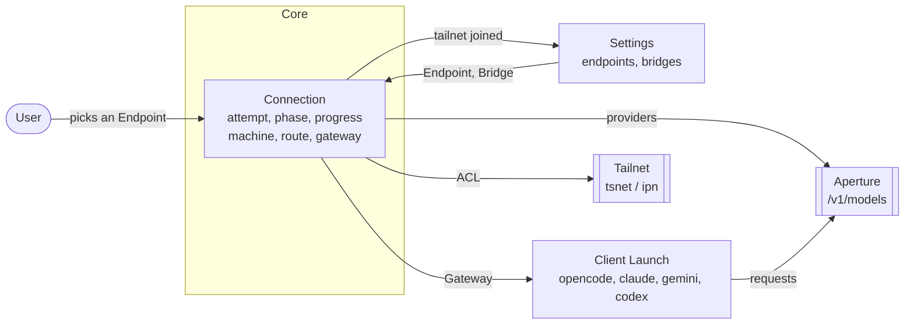

# Connection context map

Connection owns the wait between choosing an endpoint and giving a client a
verified destination. Settings commits a URL edit only after verification;
logging out a Machine invalidates every destination reached through it. The
lifecycle corrections are recorded in [ADR 0003](../adr/0003-preserve-verified-connections.md).
Short names belong to the Machine's own MagicDNS suffix; visibility of a shared
peer does not give it a local alias. Login links cross into the desktop as URLs,
never shell commands, and do not cross into persistent diagnostics. See
[ADR 0004](../adr/0004-contain-connection-authority.md).

The context boundaries below also describe the proposed broader event refactor.

## Ubiquitous language

| Term | Means | Does not mean |
|---|---|---|
| Connection Attempt | One try at reaching an Aperture from one Endpoint. Has identity, a phase, a recorded progress trail, and exactly one outcome. | The TCP connection. The persisted endpoint list. |
| Endpoint | The remote Aperture the user chose and the way to it. Two kinds and no third: a DirectEndpoint the host reaches itself, a BridgeEndpoint reached through a Bridge's Machine. The kind is the type, never an empty field. | The local proxy address. Anything the CLI listens on. |
| Gateway | The address a client is finally told to send requests to. The Endpoint URL when no Bridge is involved, the Route's local end when one is. | The Endpoint. Only equal to it in the direct case. |
| Route | The local door to one Endpoint through one Machine: a `127.0.0.1:0` listener reverse-proxying over the Machine. | A tailnet route or subnet route. |
| Bridge | The thing the user configures and sees in the picker: id, display name, last tailnet joined. Persisted. | The running tsnet node. |
| Machine | What this program runs on the user's tailnet for one Bridge: registers, may need a login, gets an address, carries dials, and shows up under Machines in their admin console. Outlives any one Attempt. | The Bridge record. The proxy. The computer aperture is running on. |
| Machines | The process's Machines, one per Bridge. Where a Machine is created and where they are all closed. | A manager. It does no network work of its own. |
| Login Link | The URL that authorizes a Machine. `https` only, no whitespace, opened in a browser or copied. | Any URL in a log line. |
| Phase | What the Attempt is waiting on right now, named for what the user is waiting for. | `ipn.State`. |
| Progress | The trail of phases an Attempt passed through and how long each took. The thing that was missing when a 29s wait could not be attributed. | The scrolling log. |
| Tailnet | The network a Machine joined. Recorded on the Bridge so the picker can name it before the Machine exists. | |
| Provider | A model provider read from the Aperture's `/v1/models`. | |

`Machine` is not our coinage. It is the word the thing already has in the system
it lives in: registration is `POST /machine/register`
(`controlclient/direct.go:839`), the identity is a `MachineKey`, the state we
wait on is `ipn.NeedsMachineAuth`, and the admin console lists it under
Machines. Taking the existing name means the user, the control plane and this
code all say the same word. `Node` was the alternative and is worse: tsnet uses
it for our node and for every peer in the netmap at once.

## Contexts

| Context | Subdomain | Owns | Lives in |
|---|---|---|---|
| Connection | Core | Connection Attempt, Phase, Progress, Login Link, Gateway, Route, Machine, Machines | `internal/bridges`. `internal/tui` presents and dispatches, and decides nothing. |
| Settings | Supporting | Endpoint, Bridge, persistence | `internal/config` |
| Client Launch | Supporting | Per-client config and env, written from a Gateway | `internal/clients/*`, `internal/profiles` |
| Tailnet | Generic, external | Nodes, login, netmap, dialing | `tsnet`, `ipn`, `ipnstate`, `client/local` |
| Aperture | Generic, external | `/v1/models` | the remote service |

Connection is deliberately one context and not three. It spans bridge bring-up
*and* the model fetch that follows, because a user waiting 29 seconds does not
know or care which half they are in, and splitting them is exactly what left
nobody owning the question "what is this attempt waiting on".

## Relationships

| Upstream | Downstream | Pattern | Note |
|---|---|---|---|
| Settings | Connection | Shared kernel | `Endpoint` and `Bridge` are already value/entity types Connection uses unchanged. No translation needed and none wanted. |
| Connection | Client Launch | Published language | Launch receives a `Gateway` and nothing else about how it was obtained. Today it receives `g.ApertureHost`, which is the same field for two different things. |
| Tailnet | Connection | Anti-corruption layer | `internal/bridges` is the only importer of `tsnet`/`ipn`/`ipnstate`. The port must stop returning `*ipnstate.Status`. |
| Aperture | Connection | Conformist | We take `/v1/models` as given; `config.ParseProviders` is the only translation. |

## Anti-corruption layer

`internal/bridges` is the ACL and the only importer of `tsnet`, `ipn`,
`ipnstate` and `client/local`. The existing `tailnetNode` port leaks
`*ipnstate.Status`; the replacement speaks Connection's own types and publishes
`Event`.

Owning the IPN bus watch means not calling `tsnet.Server.Up`, so we take on
what `Up` does beyond waiting for `ipn.Running` (`tsnet/tsnet.go:533`):

| What `Up` does | How we do it |
|---|---|
| `s.LocalClient()`, which triggers `Start` | unchanged, we already call it |
| its own `lc.WatchIPNBus(NotifyInitialState)` | ours becomes the only one |
| fails on any `Notify.ErrMessage` | same, surfaced as `Failed` |
| `lc.Status` and a non-empty `TailscaleIPs` check | same call, already on the port |
| `resetServeStateOnce` | skipped |

Skipping `resetServeStateOnce` is deliberate. It clears serve config and
service advertisements left by an earlier run of a differently configured
program, and we call neither `SetServeConfig` nor set `AdvertiseServices`, so
it has nothing of ours to clear. Both halves are reachable from exported API if
that changes: `lc.SetServeConfig`, and `EditPrefs` with `AdvertiseServicesSet`.

`printAuthURLLoop` cannot be switched off. `go s.printAuthURLLoop()` is
unconditional in `start()` and no field or envknob guards it, so a no-op
`Server.UserLogf` is the only way to stop its prose reaching us. With a typed
`LoginRequired` event its output is not a source any more. Watchers go three to
two while a login is outstanding, then to one: it exits when the state leaves
`NeedsLogin`.

## Ambiguous terms, resolved

| Word | Meaning A | Meaning B | Resolution |
|---|---|---|---|
| `ApertureHost` | the remote Aperture URL (direct endpoint) | the localhost proxy address (bridged endpoint) | Split. `Endpoint` is always the remote. `Gateway` is always what a client uses. `config/global.go:63` already carries a comment apologising for the overload. |
| `host` on `endpointActivationResult` | `ep.URL` on failure | the Route's local URL on success | Becomes `Gateway`, set only on success. A failed Attempt has no Gateway. |
| Bridge | the persisted record | the running tsnet node | Split into `Bridge` and `Machine`. "The bridge is not logged in" currently cannot be read unambiguously. |
| connected | `model.connected`, meaning the last fetch succeeded | `ipn.Running` | Keep `connected` for the former only. The latter is a Phase, never surfaced by that word. |
| Status | `*ipnstate.Status` | what phase an Attempt is in | `Status` leaves the vocabulary. Phase is the only word for the second. |
| machine | the Machine we run on the user's tailnet | the computer aperture is running on, as in `browser.go:69` on which machine's clipboard an SSH session writes to | The domain object takes the word. The computer is the host. That comment needs rewording when its file is touched. |

## Stored, derived, transient

| Fact | Where it lives |
|---|---|
| Endpoint list, active endpoint | stored, `settings.json` |
| Bridge id, name, last tailnet | stored, `settings.json` |
| Machine tailnet credentials | stored by tsnet under the bridge state dir, never by us |
| Machine, Route | transient, process lifetime, keyed by bridge id |
| Connection Attempt, Phase, Progress | transient, attempt lifetime |
| Gateway | transient, overwritten per successful Attempt |
| Providers | derived from the Aperture, cached on `Global` |

## Still open

- Whether `Phase` should survive a Machine being reused. A second Attempt over
  an already-open Machine skips five of the seven phases; today it silently
  reports nothing at all.
- Whether the Aperture context deserves an ACL. `ParseProviders` is the whole
  surface, so conformist is honest for now.
