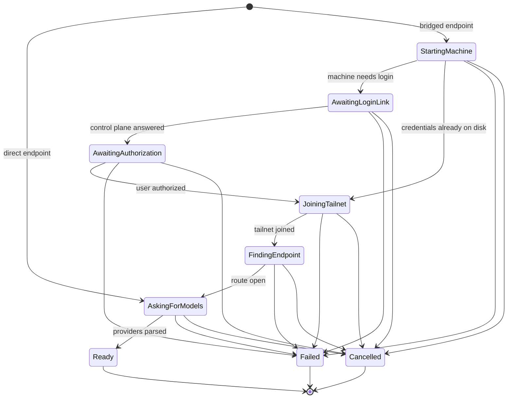
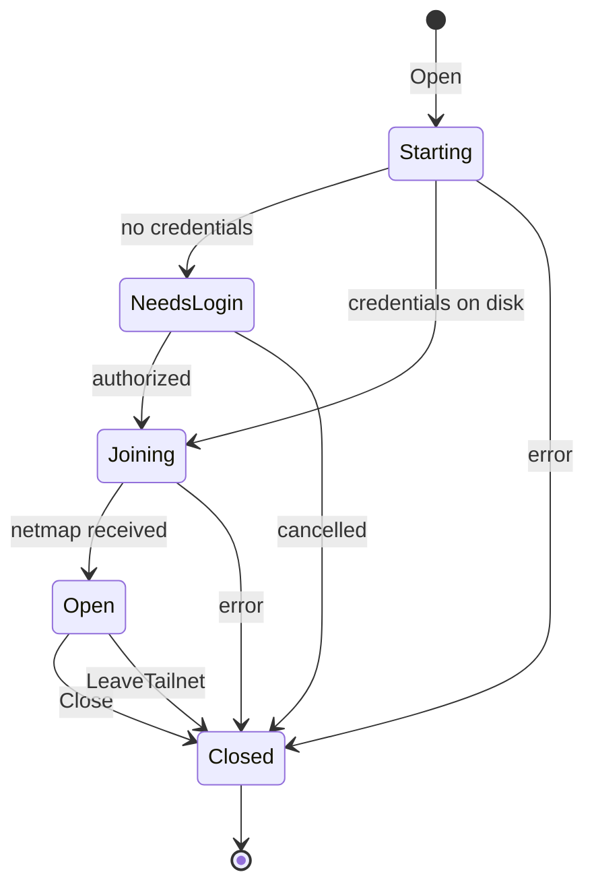
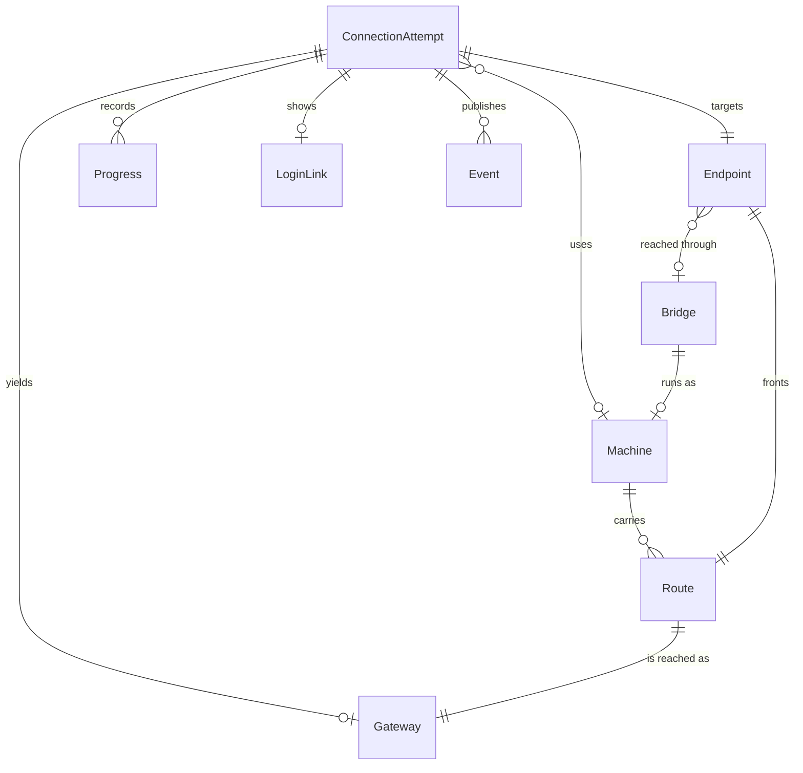
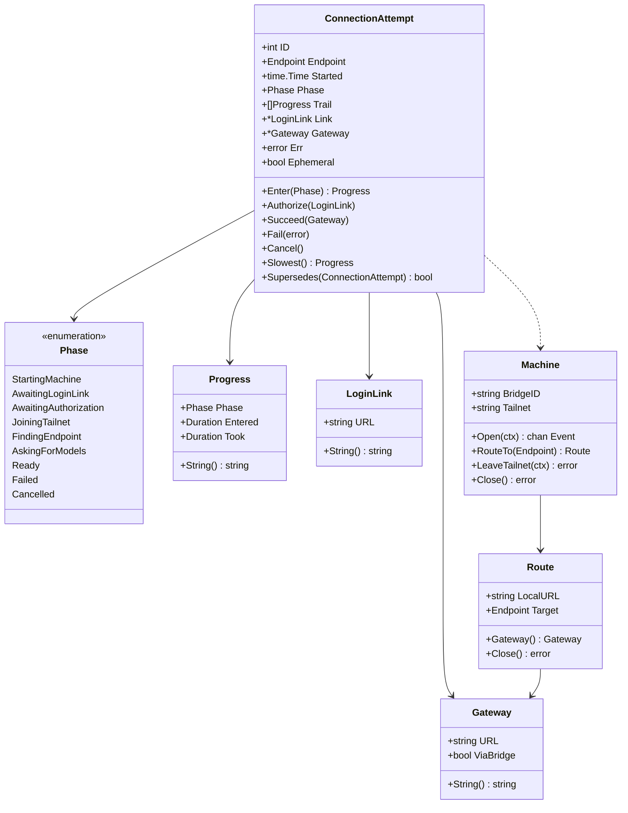

# Connection domain model

Objects in the Connection context. Language is fixed by
[the context map](connection-context-map.md).

## ConnectionAttempt

Entity, aggregate root. One try at reaching an Aperture. Created when the user
picks an Endpoint, ends in exactly one outcome, and is superseded by any newer
Attempt.

### Fields

| Field | Type | Note |
|---|---|---|
| `ID` | `int` | Monotonic per process. Identity: a result carrying a stale ID is discarded, which is how cancellation works today (`tui.go:652`). |
| `Endpoint` | `config.Endpoint` | The remote Aperture and, optionally, the Bridge that reaches it. |
| `Started` | `time.Time` | Origin for every elapsed time in `Trail`. |
| `Phase` | `Phase` | What it is waiting on now. |
| `Trail` | `[]Progress` | Every phase entered, in order. Never rewritten. |
| `Link` | `*LoginLink` | Set once, when a Machine asks for authorization. Nil for a direct Endpoint or a Machine already logged in. |
| `Gateway` | `*Gateway` | Set once, on reaching `Ready`. Nil otherwise. |
| `Err` | `error` | Set once, on reaching `Failed`. |
| `Ephemeral` | `bool` | The Endpoint was written to settings on the user's behalf, so cancelling takes it back out. |

### Behaviors

- `Enter(Phase) Progress` — advance, appending to `Trail`. Rejects a backwards move.
- `Authorize(LoginLink)` — record the link and enter `AwaitingAuthorization`.
- `Succeed(Gateway)` / `Fail(error)` / `Cancel()` — terminal, once.
- `Slowest() Progress` — the phase that consumed the most wall clock. This is the question a 29 second wait asks and that nothing could answer.
- `Supersedes(other ConnectionAttempt) bool` — `a.ID > other.ID`.

### Invariants

- Exactly one terminal outcome. After `Ready`, `Failed` or `Cancelled`, no field changes.
- `Gateway` is non-nil if and only if `Phase == Ready`.
- `Err` is non-nil if and only if `Phase == Failed`.
- Phase only moves forward through the order below, except to a terminal phase, which is reachable from anywhere.
- `Trail` covers `Started` to now with no gaps: every phase transition appends, so summing `Trail` accounts for the whole wait. This is the invariant the current code lacks, and its absence is why three fixes were aimed at an unattributed 29 seconds.
- A direct Endpoint (`BridgeID == ""`) never enters a Machine phase.

### States

### Relationships

- 1 ConnectionAttempt → 1 Endpoint.
- 1 ConnectionAttempt → 0..1 Machine, by bridge id, not by ownership. The Machine outlives the Attempt.
- 1 ConnectionAttempt → 0..n Progress, ordered.
- 1 ConnectionAttempt → 0..1 LoginLink, 0..1 Gateway.

## Phase

Enumeration. Named for what the user is waiting for, not for `ipn.State`.

| Phase | The user is waiting for | Signal it is entered |
|---|---|---|
| `StartingMachine` | the bridge to start | `tsnet` init returns a local client |
| `AwaitingLoginLink` | the control plane to hand back a login link | `ipn.NeedsLogin` with no `BrowseToURL` yet |
| `AwaitingAuthorization` | themselves, in a browser | `Notify.BrowseToURL` |
| `JoiningTailnet` | the tailnet to accept the node | `ipn.Starting`, which is the one notification that covers login finishing and the netmap landing |
| `FindingEndpoint` | the far side to appear and accept a dial | `ipn.Running`, then the peer-map wait in `waitForPeerAddr` |
| `AskingForModels` | Aperture to answer `/v1/models` | the fetch starts |
| `Ready` | nothing | providers parsed |
| `Failed` | nothing | any error |
| `Cancelled` | nothing | the user pressed Esc, or a newer Attempt started |

`AwaitingLoginLink` is the phase that did not exist. The goroutine dump behind
this work was parked in the control plane's first `POST /machine/register`
with no follow-up URL yet, which is precisely this phase, and the screen said
only `NeedsLogin`. Distinguishing it from `AwaitingAuthorization` is the whole
point of naming phases for the waiting rather than for the backend state:
those two are the same `ipn.State` and completely different problems.

## Progress

Value object. One phase and what it cost.

| Field | Type |
|---|---|
| `Phase` | `Phase` |
| `Entered` | `time.Duration` since the Attempt started |
| `Took` | `time.Duration`, zero while current |

Behaviors: `String()` renders `+12.5s  Waiting for a login link`, the format
the connect screen already uses.

Invariants: `Entered` is monotonic across an Attempt's `Trail`. `Took` is set
exactly once, when the next phase is entered.

## LoginLink

Value object. The URL that authorizes a Machine.

| Field | Type |
|---|---|
| `URL` | `string` |

Behaviors: `ParseLoginLink(string) (LoginLink, error)`, the only constructor.
`String()`.

Invariants: `https` scheme, no whitespace, non-empty host. These are not
cosmetic: the value is handed to a desktop opener. The checks exist today
inside `authURLFromLog` (`browser.go:35`), downstream of a `strings.Cut` on
prose, which is the wrong place for them. Tailscale applies the same rules
upstream in `validPopBrowserURLLocked`; ours is the second gate, not the first.

## Gateway

Value object. Where a client sends requests.

| Field | Type |
|---|---|
| `URL` | `string` |
| `ViaBridge` | `bool` |

Behaviors: `DirectGateway(Endpoint) Gateway`, `RoutedGateway(Route) Gateway`,
`String()`.

Invariants: non-empty absolute URL with scheme and host. `ViaBridge` is true
if and only if the URL is a Route's local end. Nothing outside the Connection
context needs `ViaBridge`; it exists so a log or an error can say which of the
two a URL is, which `ApertureHost` cannot.

## Machine

Entity, aggregate root. What this program runs on the user's tailnet for one
Bridge, and what their admin console lists under Machines. Separate aggregate
from ConnectionAttempt because it is cached by bridge id and reused across
Attempts (`Manager.nodes`), so it cannot be owned by any one of them.

| Field | Type | Note |
|---|---|---|
| `BridgeID` | `string` | Identity. At most one Machine per Bridge. |
| `Tailnet` | `string` | The network joined, empty until the netmap lands. |
| `Routes` | `map[string]*Route` | Keyed by target URL. |

Behaviors: `Open(ctx) (<-chan Event, error)`, `RouteTo(Endpoint) (Route, error)`,
`LeaveTailnet(ctx) error`, `Close() error`.

Invariants:
- A Route can only be created through an open Machine.
- `LeaveTailnet` destroys the Machine: credentials live behind the node's own LocalAPI, so a close without a logout silently reuses them next time.
- Closing closes every Route first.
- Exactly one IPN bus watch per Machine. Today there are two of ours plus one of tsnet's; see the ADR.

### States

## Route

Entity, inside the Machine aggregate. The local door to one Endpoint.

| Field | Type |
|---|---|
| `LocalURL` | `string`, a `127.0.0.1:<port>` listener |
| `Target` | `config.Endpoint` |

Behaviors: `Gateway() Gateway`, `Close() error`.

Invariants: belongs to exactly one Machine and one Endpoint. Its listener is
bound to loopback only. Resolves the target against the Machine's own peer map
before dialing, never the host resolver, because the host may itself be on a
tailnet with a same-named node.

## Event

Value object. What the Connection context publishes as an Attempt proceeds.
This replaces the `func(string)` log sink and the `chan bridgeLine`.

| Event | Carries | Meaning |
|---|---|---|
| `PhaseEntered` | `Phase`, `Progress` | The Attempt advanced. |
| `LoginRequired` | `LoginLink` | Authorization is needed at this link. |
| `TailnetJoined` | `string` | The Machine is on this network. |
| `Noted` | `string` | Diagnostics with no domain meaning: tsnet backend chatter, dial detail. |
| `Failed` | `error` | Terminal. |
| `Ready` | `Gateway` | Terminal. |

Invariants:
- `Noted` is the only droppable event. Everything else must be delivered even
  under a full buffer. The current sink drops on a full channel
  (`bridgeLogSink`, `tui.go:557`, a `select` with `default`) and with `--debug`
  the tsnet backend logger shares that 32-slot channel, so the login link can
  be discarded by a burst of chatter. A typed stream makes that a rule instead
  of an accident.
- `Ready` and `Failed` are mutually exclusive and each occurs at most once.
- No event carries a vendor type. `*ipnstate.Status` never crosses this line.

## Everything at once

## Open, not assumed

- Two cross-aggregate reactions have no owning object, found by the
  [contracts pass](connection-contracts.md): recording the tailnet a Machine
  joined onto its Bridge, and deciding which Gateway is current for the next
  client launch. Both live in the TUI today, which orchestrates but should not
  decide. Needs resolving before the events are implemented.
- Whether a reused Machine should replay its phases to a second Attempt or
  report a single `FindingEndpoint`. Today it reports nothing, which looks like
  a hang for as long as the peer wait takes.
- Whether `Trail` should be surfaced to the user at all, or only on failure and
  under `--debug`. Timing every phase is worth doing regardless; showing it
  always is a separate question.
- Whether `Route` deserves a lifecycle of its own. It is currently created once
  and closed with its Machine, so it has no interesting states, and a state
  machine for it would be invented rather than observed.
