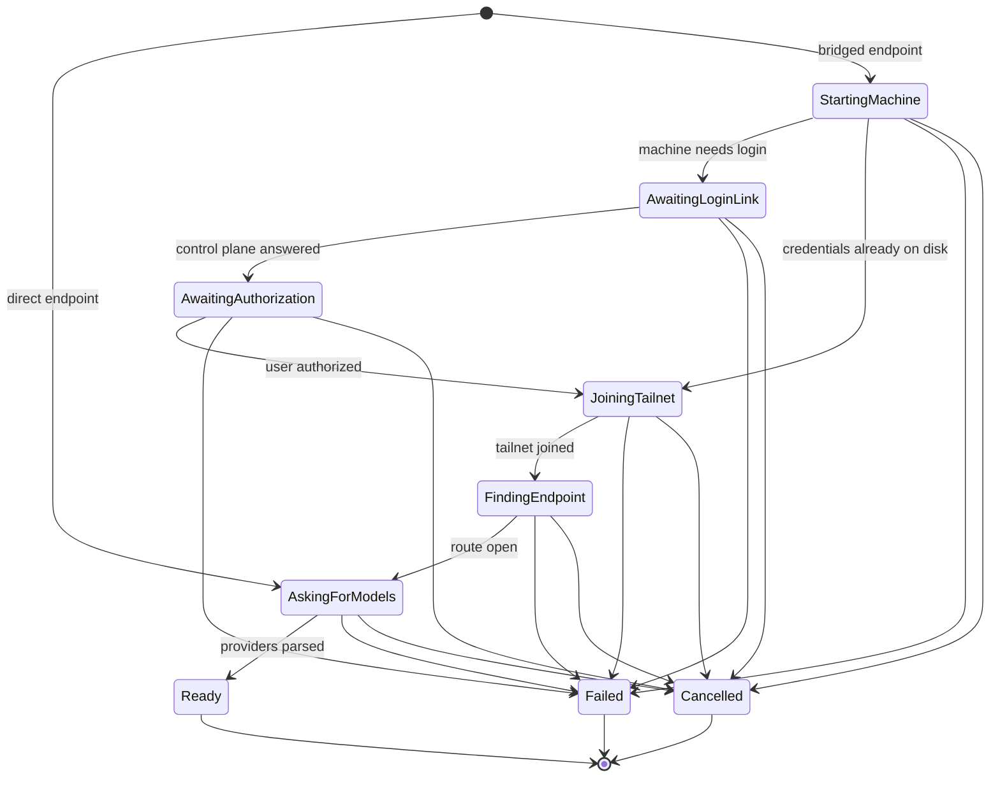
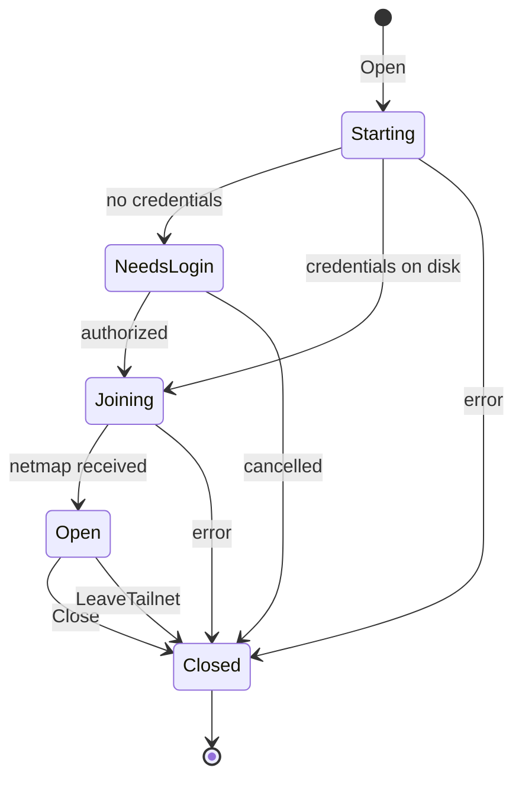
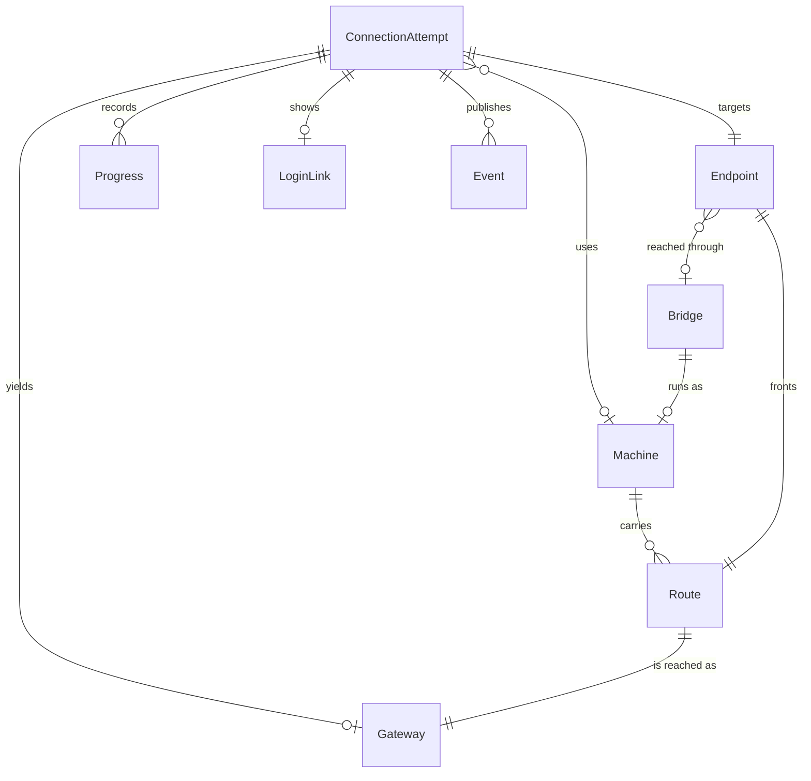
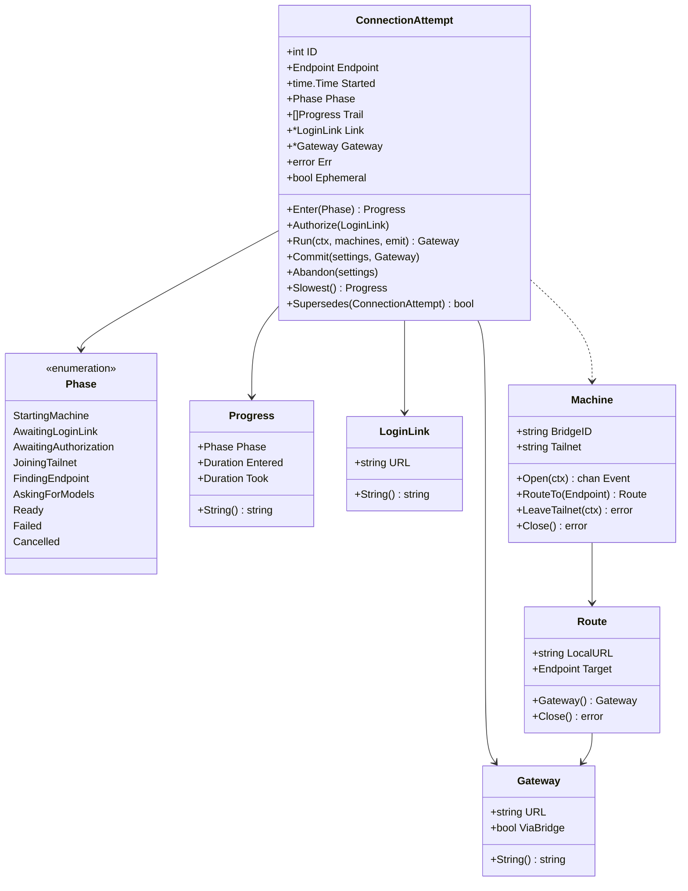

# Connection domain model

Connection attempts may propose an endpoint edit but cannot replace a verified
destination until success. A Machine serializes activation, logout and closure;
its presence in the cache alone does not prove it is open. Language is fixed by
[the context map](connection-context-map.md).

## Security correction

The existing objects gain stricter invariants, not new domain objects or stored
fields. An Endpoint's bare hostname resolves against the Machine's current
MagicDNS suffix; a shared peer needs its explicit FQDN. Missing suffix information
does not authorize a first-label match. Existing tsnet fallback for non-peer
destinations remains unchanged.

LoginLink remains a value object with its sole `url string` field. Its value is
available to the interactive UI, browser and clipboard; parse errors contain
only rejection reasons, not the input. Windows passes it to the native URL
opener, never to a command interpreter. Aperture's run log retains the
login-required fact but omits the link. Raw bridge diagnostic URLs are redacted
before entering that log, including backend debug output and login errors;
this deliberately loses URL detail. The SDK's separate logtail pipeline is
upstream of these callbacks and is not changed by this correction.

Shutting the Machines down is one session-lifetime operation. `Machines.Close`
uses the standard library's once-result primitive to join concurrent callers
and retain the same error. The first caller refuses new members and closes
each Machine, which cancels the operation it is running; every caller waits
until all Machines have finished closing. No new domain event, JSON field, or
migration is introduced.

## Lifecycle correction implemented in this pass

The following is the concrete model for [ADR 0003](../adr/0003-preserve-verified-connections.md).
The later sections retain the wider proposed event model.

`bridges.Attempt` is the ConnectionAttempt entity as built. Its fields are
`Endpoint config.Endpoint`, `InvalidatesActive bool`, `TargetsActive bool`,
`bridge config.Bridge`, `ephemeral bool`, `replaces config.Endpoint` and
`switchTailnet bool`.
`replaces` is the original endpoint value, optional for a URL edit. Retry and
inline override retain it; success commits the new endpoint and removes the
original in one settings write. Failure leaves the original and the candidate;
cancellation removes only a candidate this attempt added. Neither outcome
changes a verified runtime destination or its providers. The TUI's
`activation` is the presentation of one Attempt: `id`, `label`, `started`,
`cancel`, the log tail, the phase shown, the login link and the inline
override editor. It holds no domain fields.

`Machine` is an entity, identified by its Bridge and held in `Machines`. It
owns `tailnet string`, `routes map[string]*Route`, `node tailnetNode`, `ev
*liveEvents`, the turn it grants one operation at a time and the `cancel` that
lets `Close` interrupt that operation. Its behaviours are `Open`, `RouteTo`,
`LeaveTailnet`, `Destroy`, `Close` and `Tailnet`. The adapter fields stay in
`internal/bridges`; no vendor type enters a public signature.

States are idle (no node), starting, open, and closing. `Open` holds the
Machine through startup; `RouteTo` through proxy creation and requires an open
Machine. A failed startup closes the node before releasing the Machine.
`LeaveTailnet` initializes the LocalAPI without waiting for authorization,
logs out, then closes the node and all Routes; the Machine returns to idle and
may create a new node on the next `Open`. `Destroy` is `LeaveTailnet` plus the
state directory. `Machines.Close` closes each Machine, which cancels the
operation it is running, waits for it, and rejects new operations. An
operation waiting its turn can be cancelled without affecting the one running.

`BeginAttempt` marks the attempt as invalidating the active destination when
a tailnet switch is on the Bridge the active endpoint uses; the TUI shows that
as unverified before dispatch. It also records whether the attempt targets the
active endpoint, so a failure can leave that unverified too. This is conservative when cancellation beats
logout, since cancellation cannot prove logout did not start. Failure, Escape
and removal must not re-enable launches; only verification does. A switch on a
different bridge leaves the active destination usable.

## ConnectionAttempt

Entity, aggregate root. One try at reaching an Aperture. Created when the user
picks an Endpoint, ends in exactly one outcome, and is superseded by any newer
Attempt.

### Fields

| Field | Type | Note |
|---|---|---|
| `ID` | `int` | Monotonic per process. Identity: a result carrying a stale ID is discarded, which is how cancellation works today (`tui.go:652`). |
| `Endpoint` | `config.Endpoint` | The remote Aperture and, optionally, the Bridge that reaches it. |
| `Started` | `time.Time` | Origin for every elapsed time in `Trail`. |
| `Phase` | `Phase` | What it is waiting on now. |
| `Trail` | `[]Progress` | Every phase entered, in order. Never rewritten. |
| `Link` | `*LoginLink` | Set once, when a Machine asks for authorization. Nil for a direct Endpoint or a Machine already logged in. |
| `Gateway` | `*Gateway` | Set once, on reaching `Ready`. Nil otherwise. |
| `Err` | `error` | Set once, on reaching `Failed`. |
| `Ephemeral` | `bool` | The Endpoint was written to settings on the user's behalf, so cancelling takes it back out. |

### Behaviors

- `Enter(Phase) Progress` — advance, appending to `Trail`. Rejects a backwards move.
- `Authorize(LoginLink)` — record the link and enter `AwaitingAuthorization`.
- `Run(ctx, machines, emit) (Gateway, error)` — the attempt happening: leave the tailnet if asked, open the Machine, route, ask the Aperture for models. Writes nothing, so it runs off the update loop.
- `Commit(settings, Gateway) error` — persist a successful attempt: one settings write for the edit, the tailnet recorded on the Bridge, the Gateway and providers clients launch against.
- `Abandon(settings) error` — remove the candidate this attempt added, never the active endpoint. Failure is not abandonment: a failed attempt keeps its candidate for retry and edit.
- `Retarget(settings, next)` / `Retry()` — a new URL for the same edit, or the same attempt again without repeating a tailnet switch.
- Constructors `BeginAttempt(settings, endpoint, switchTailnet, replacing)` and `EditAttempt(settings, current, endpoint, next)`. Begin writes an unsaved Endpoint as the candidate and clears the Bridge's recorded tailnet before a switch.
- `Slowest() Progress` — the phase that consumed the most wall clock. This is the question a 29 second wait asks and that nothing could answer.
- `Supersedes(other ConnectionAttempt) bool` — `a.ID > other.ID`.

### Invariants

- Exactly one terminal outcome. After `Ready`, `Failed` or `Cancelled`, no field changes.
- `Gateway` is non-nil if and only if `Phase == Ready`.
- `Err` is non-nil if and only if `Phase == Failed`.
- Phase only moves forward through the order below, except to a terminal phase, which is reachable from anywhere.
- `Trail` covers `Started` to now with no gaps: every phase transition appends, so summing `Trail` accounts for the whole wait. This is the invariant the current code lacks, and its absence is why three fixes were aimed at an unattributed 29 seconds.
- A direct Endpoint (`BridgeID == ""`) never enters a Machine phase.

### States

### Relationships

- 1 ConnectionAttempt → 1 Endpoint.
- 1 ConnectionAttempt → 0..1 Machine, by bridge id, not by ownership. The Machine outlives the Attempt.
- 1 ConnectionAttempt → 0..n Progress, ordered.
- 1 ConnectionAttempt → 0..1 LoginLink, 0..1 Gateway.

## Phase

Enumeration. Named for what the user is waiting for, not for `ipn.State`.

| Phase | The user is waiting for | Signal it is entered |
|---|---|---|
| `StartingMachine` | the bridge to start | `tsnet` init returns a local client |
| `AwaitingLoginLink` | the control plane to hand back a login link | `ipn.NeedsLogin` with no `BrowseToURL` yet |
| `AwaitingAuthorization` | themselves, in a browser | `Notify.BrowseToURL` |
| `JoiningTailnet` | the tailnet to accept the node | `ipn.Starting`, which is the one notification that covers login finishing and the netmap landing |
| `FindingEndpoint` | the far side to appear and accept a dial | `ipn.Running`, then the peer-map wait in `waitForPeerAddr` |
| `AskingForModels` | Aperture to answer `/v1/models` | the fetch starts |
| `Ready` | nothing | providers parsed |
| `Failed` | nothing | any error |
| `Cancelled` | nothing | the user pressed Esc, or a newer Attempt started |

`AwaitingLoginLink` is the phase that did not exist. The goroutine dump behind
this work was parked in the control plane's first `POST /machine/register`
with no follow-up URL yet, which is precisely this phase, and the screen said
only `NeedsLogin`. Distinguishing it from `AwaitingAuthorization` is the whole
point of naming phases for the waiting rather than for the backend state:
those two are the same `ipn.State` and completely different problems.

## Progress

Value object. One phase and what it cost.

| Field | Type |
|---|---|
| `Phase` | `Phase` |
| `Entered` | `time.Duration` since the Attempt started |
| `Took` | `time.Duration`, zero while current |

Behaviors: `String()` renders `+12.5s  Waiting for a login link`, the format
the connect screen already uses.

Invariants: `Entered` is monotonic across an Attempt's `Trail`. `Took` is set
exactly once, when the next phase is entered.

## LoginLink

Value object. The URL that authorizes a Machine.

| Field | Type |
|---|---|
| `URL` | `string` |

Behaviors: `ParseLoginLink(string) (LoginLink, error)`, the only constructor.
`String()`.

Invariants: `https` scheme, no whitespace, non-empty host. These are not
cosmetic: the value is handed to a desktop opener. The checks exist today
inside `authURLFromLog` (`browser.go:35`), downstream of a `strings.Cut` on
prose, which is the wrong place for them. Tailscale applies the same rules
upstream in `validPopBrowserURLLocked`; ours is the second gate, not the first.

## Gateway

Value object, `bridges.Gateway`. What a successful Attempt produced and what
`Commit` makes current.

| Field | Type | |
|---|---|---|
| `URL` | `string` | Where a client sends requests: the Endpoint's URL, or a Route's `127.0.0.1:<port>` listener. |
| `Tailnet` | `string` | The tailnet the Machine joined. Empty for a direct Endpoint. |
| `Providers` | `[]config.ProviderInfo` | What the Aperture answered `/v1/models` with. |

Invariants: `URL` is a non-empty absolute URL with scheme and host.

## Machine

Entity, aggregate root. What this program runs on the user's tailnet for one
Bridge, and what their admin console lists under Machines. Separate aggregate
from ConnectionAttempt because it is held by Bridge in `Machines` and reused
across Attempts, so it cannot be owned by any one of them.

| Field | Type | Note |
|---|---|---|
| `bridge` | `config.Bridge` | Identity is its ID. At most one Machine per Bridge. |
| `tailnet` | `string` | The network joined, empty until the netmap lands and after leaving. |
| `routes` | `map[string]*Route` | Keyed by target URL. |

Behaviors: `Open(ctx, emit) error`, `RouteTo(ctx, url, emit) (*Route, error)`,
`LeaveTailnet(ctx, emit) error`, `Destroy(ctx, emit) error`, `Close() error`,
`Tailnet() string`. Each reports what it waits on to `emit`.

Invariants:
- A Route can only be created through an open Machine. `RouteTo` fails rather than starts a node.
- One operation at a time, cleanup included. Two Machines for one Bridge would open the same state directory, so only `Machines` creates them.
- `LeaveTailnet` logs out before closing: credentials live behind the node's own LocalAPI, so a close without a logout silently reuses them next time. `Destroy` also discards the state directory, last and only on success, because it holds the key a later attempt needs to deregister.
- Closing closes every Route first.
- Exactly one IPN bus watch per Machine.

### States

## Route

Entity, inside the Machine aggregate. The local door to one Endpoint.

| Field | Type |
|---|---|
| `LocalURL` | `string`, a `127.0.0.1:<port>` listener. The Gateway a client uses. |

Behaviors: `close() error`, reached only through its Machine.

Invariants: belongs to exactly one Machine and one Endpoint. Its listener is
bound to loopback only. Resolves the target against the Machine's own peer map
before dialing, never the host resolver, because the host may itself be on a
tailnet with a same-named node.

## Machines

Collection. The process's Machines, one per Bridge, and the only place a
Machine is created. Getting a member does no network work.

Behaviors: `For(Bridge) (*Machine, error)`, which creates an idle member on
first use and refuses after `Close`; `Close() error`, which closes every
member and lets concurrent callers share one result.

Invariants: at most one Machine per Bridge ID. A Bridge ID that is not the
generated `bridge-<hex>` shape is refused before it can become a hostname.

## Removing a Bridge

The one transition no single aggregate owns: a Bridge record and the Machine
registered for it go together, Machine first (ADR 0002). Four functions in
`internal/bridges` and a Settings rule.

| Operation | Runs on | Does |
|---|---|---|
| `CheckRemovable(settings, bridge, endpoint)` | update loop | Returns an error when the endpoint, or the bare bridge, cannot be removed: the active endpoint, or a bridge an endpoint still connects through. |
| `WillDestroyMachine(settings, bridge, endpoint)` | update loop | Reports whether removing the endpoint, or the bare bridge, logs a device out of a tailnet: the bridge started a Machine and no other endpoint connects through it. |
| `Machines.Destroy(ctx, bridge, emit)` | any goroutine | The bounded logout (ADR 0002 decision 6). Returns an error when the tailnet refuses or does not answer in time. Writes nothing. |
| `RemoveFromSettings(settings, bridge, endpoint)` | update loop | Deletes the endpoint, then the bridge when nothing connects through it. Called only after `Destroy` returned nil, or when nothing needs destroying. |
| `Machines.Tailnet(bridge)` | update loop | The tailnet the running Machine reports, else the one saved on the bridge. |

Any failure keeps the records. They are the only thing naming the device, and
removing the connection again retries the logout. The failure message names
the device so the user can delete it in the admin console if the retry finds
nothing to log out.

The split between the goroutine half and the update-loop half is not
stylistic, here or on ConnectionAttempt. Nothing serializes access to
`config.Global`; the bubbletea update loop is the only place settings are
read, so it is the only place they may be written.

## Event

Value object. What the Connection context publishes as an Attempt proceeds.
This replaces the `func(string)` log sink and the `chan bridgeLine`.

| Event | Carries | Meaning |
|---|---|---|
| `PhaseEntered` | `Phase`, `Progress` | The Attempt advanced. |
| `LoginRequired` | `LoginLink` | Authorization is needed at this link. |
| `TailnetJoined` | `string` | The Machine is on this network. |
| `Noted` | `string` | Diagnostics with no domain meaning: tsnet backend chatter, dial detail. |
| `Failed` | `error` | Terminal. |
| `Ready` | `Gateway` | Terminal. |

Invariants:
- `Noted` is the only droppable event. Everything else must be delivered even
  under a full buffer. The current sink drops on a full channel
  (`bridgeLogSink`, `tui.go:557`, a `select` with `default`) and with `--debug`
  the tsnet backend logger shares that 32-slot channel, so the login link can
  be discarded by a burst of chatter. A typed stream makes that a rule instead
  of an accident.
- `Ready` and `Failed` are mutually exclusive and each occurs at most once.
- No event carries a vendor type. `*ipnstate.Status` never crosses this line.

## Everything at once

## Open, not assumed

- Which Gateway is current for the next client launch is now `Attempt.Commit`
  writing `Global.ApertureHost`, and recording the tailnet a Machine joined is
  the same commit. Whether that Gateway is still verified is the TUI's
  `connected` flag, set from `InvalidatesActive` and `TargetsActive`. No object owns
  "the current Gateway and whether it is verified"; `Global` holds the URL and
  the TUI holds the bit.
- Whether a reused Machine should replay its phases to a second Attempt or
  report a single `FindingEndpoint`. Today it reports nothing, which looks like
  a hang for as long as the peer wait takes.
- Whether `Trail` should be surfaced to the user at all, or only on failure and
  under `--debug`. Timing every phase is worth doing regardless; showing it
  always is a separate question.
- Whether `Route` deserves a lifecycle of its own. It is currently created once
  and closed with its Machine, so it has no interesting states, and a state
  machine for it would be invented rather than observed.
